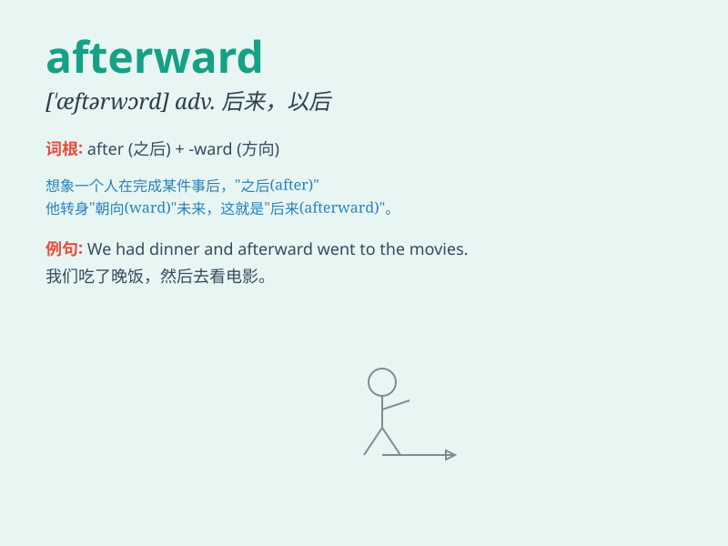

## afterward

**英音:** _[\'ɑːftəwəd]_ **美音:** _[ˈæftərwərd]_

**译义:** *adv.然后,后来*

### 短语

+ **shortly afterward:** _不久之后_

+ **soon afterward:** _不久以后_

+ **not long afterward:** _不久之后_

+ **moments afterward:** _片刻之后_

+ **days afterward:** _几天后_

### 例句

#### 例句1

> **I went to the store and afterward, I had lunch.**

**中文翻译:** 我去了商店，然后我吃了午饭。

**单词释义:** 然后，之后

#### 例句2

> **He finished his homework and afterward played video games.**

**中文翻译:** 他完成了作业，之后玩了电子游戏。

**单词释义:** 之后

#### 例句3

> **The party ended and afterward everyone went home.**

**中文翻译:** 聚会结束了，随后大家都回家了。

**单词释义:** 随后

### 背诵小故事

> Once upon a time, a little girl lost her toy. She looked everywhere.
Afterward, she found it under the bed. It made her very happy. The word
\'afterward\' means later or subsequently.

**从前，一个小女孩丢了她的玩具。她到处找。后来，她在床底下找到了。这让她非常高兴。单词\'afterward\'意思是后来，随后。**

### 图义

