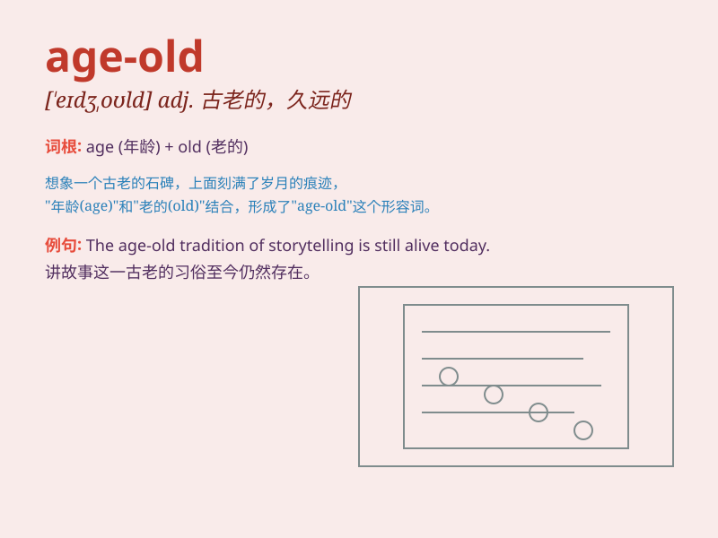

## age-old

**英音:** _[eɪdʒ oʊld]_ **美音:** _[eɪdʒ oʊld]_

**译义:** *adj.古老的，久远的；年深日久的*

### 短语

+ **age-old problem:** _古老的问题_

+ **age-old custom:** _古老的习俗_

+ **age-old tradition:** _古老的传统_

+ **age-old wisdom:** _古老的智慧_

+ **age-old story:** _古老的故事_

### 例句

#### 例句1

> **The age-old question of what makes a good life has no simple
answer.**

**中文翻译:** 关于什么造就美好生活这个古老的问题没有简单的答案。

**单词释义:** 古老的；由来已久的

#### 例句2

> **There is an age-old tradition of celebrating this festival in our
town.**

**中文翻译:** 在我们镇上有庆祝这个节日的古老传统。

**单词释义:** 古老的；由来已久的

#### 例句3

> **The age-old conflict between good and evil continues to fascinate
storytellers.**

**中文翻译:** 善与恶之间由来已久的冲突继续让讲故事的人着迷。

**单词释义:** 由来已久的

### 背诵小故事

> Once upon a time, there was an ancient castle. It had stood for an
age-old time. People said it held many secrets and stories from
generations past. \'Age-old\' means very old or having existed for a
long time.

**从前，有一座古老的城堡。它已经存在了很久很久。人们说它承载着许多过去几代人的秘密和故事。'age-old'意思是古老的，存在很久的。**

### 图义

