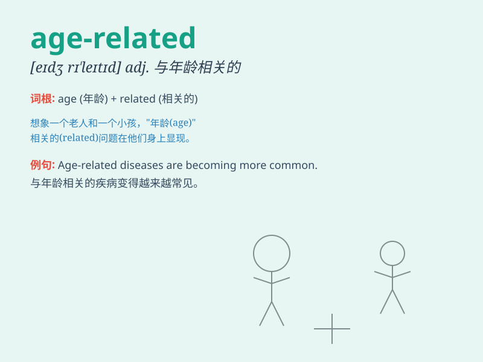

## age-related

**英音:** _[eɪdʒ rɪˈleɪtɪd]_ **美音:** _[eɪdʒ
rɪˈleɪtɪd]_

**译义:** *adj.与年龄相关的；与年龄有关的*

### 短语

+ **age-related diseases:** _与年龄相关的疾病_

+ **age-related changes:** _与年龄相关的变化_

+ **age-related decline:** _与年龄相关的衰退_

+ **age-related macular degeneration:** _年龄相关性黄斑变性_

+ **age-related memory loss:** _与年龄相关的记忆力减退_

### 例句

#### 例句1

> **Age-related diseases are becoming more common in modern
society.**

**中文翻译:** 与年龄相关的疾病在现代社会变得越来越常见。

**单词释义:** 与年龄有关的

#### 例句2

> **The company is conducting research on age-related changes in
consumer preferences.**

**中文翻译:** 该公司正在对消费者偏好中与年龄相关的变化进行研究。

**单词释义:** 与年龄有关的

#### 例句3

> **She has some age-related vision problems.**

**中文翻译:** 她有一些与年龄相关的视力问题。

**单词释义:** 与年龄有关的

### 背诵小故事

> Once upon a time, a scientist was studying health problems. He found
many issues were \'age-related\'. Like weak bones in old people. It
means connected to a person\'s age.

**从前，有位科学家在研究健康问题。他发现很多状况都是"与年龄相关的"。比如老年人骨骼脆弱。这个词意思是与某人的年龄有关。**

### 图义

