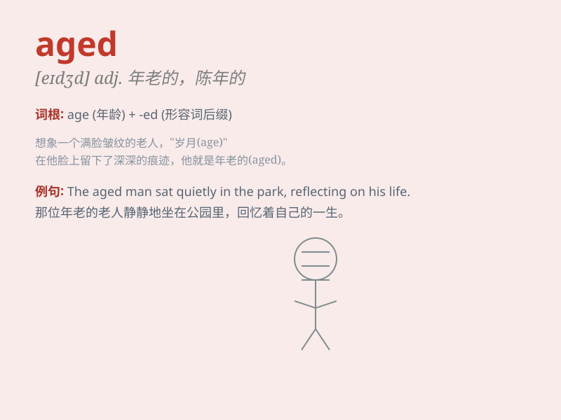

## aged

**英音:** _[\'eɪdʒɪd]_ **美音:** _[\'edʒɪd]_

**译义:** *adj.年老的,\...岁的,老年人特有的*

### 短语

+ **aged care:** _老年护理_

+ **aged wine:** _陈酿葡萄酒_

+ **middle-aged:** _中年的_

+ **old-aged:** _老年的；年迈的_

+ **aged person:** _老年人_

### 例句

#### 例句1

> **The aged man walked slowly along the street.**

**中文翻译:** 这位上了年纪的男人沿着街道慢慢地走着。

**单词释义:** 年老的；年迈的

#### 例句2

> **This wine is aged for at least ten years.**

**中文翻译:** 这种葡萄酒至少陈酿了十年。

**单词释义:** 陈化的；成熟的

#### 例句3

> **She has an aged look on her face.**

**中文翻译:** 她脸上有一副苍老的神情。

**单词释义:** 衰老的；显老的

### 背诵小故事

> Once upon a time, there was an AGED man. He had wrinkles and walked
slowly. But his wisdom was like a bright light. Despite his aged body,
his spirit was young. People respected him for his experience.

**从前，有一位上了年纪的老人。他满脸皱纹，走路缓慢。但他的智慧却如明灯般闪耀。尽管身体年迈，但他的精神依然年轻。人们因他的阅历而尊敬他。**

### 图义

