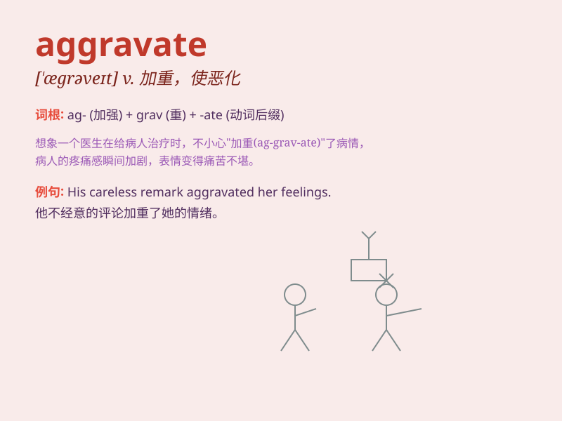

## aggravate

**英音:** _[\'ægrəveɪt]_ **美音:** _[\'æɡrəvet]_

**译义:** *vt.使恶化,加重*

### 短语

+ **aggravate the situation:** _使情况恶化_

+ **aggravate the problem:** _加重问题_

+ **aggravate the pain:** _加剧疼痛_

+ **aggravate the conflict:** _激化冲突_

+ **aggravate the illness:** _使病情加重_

### 例句

#### 例句1

> **The heat aggravated his condition.**

**中文翻译:** 高温加重了他的病情。

**单词释义:** 使加重；使恶化

#### 例句2

> **Her remarks aggravated the situation.**

**中文翻译:** 她的话使情况更糟了。

**单词释义:** 使严重；使加剧

#### 例句3

> **Don\'t aggravate the problem by being so stubborn.**

**中文翻译:** 别这么固执，以免让问题更严重。

**单词释义:** 使恶化；加剧

### 背诵小故事

> A man was already in a bad mood. But his friend kept teasing him,
which aggravated his bad mood even more. It made him extremely angry and
frustrated.

**一个男人本来心情就不好。但他的朋友不停地逗弄他，这让他的坏心情更加严重了。这使他极度生气和沮丧。**

### 图义

