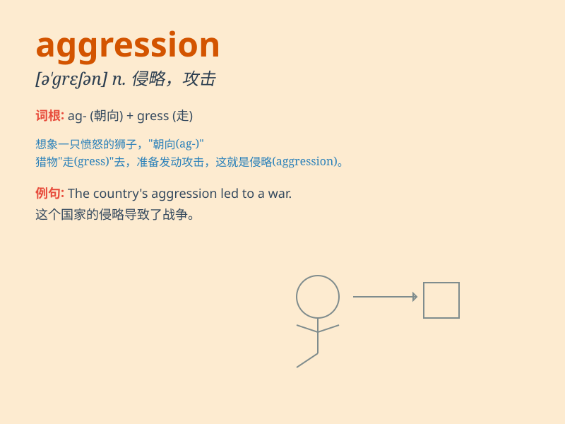

## aggression

**英音:** _[ə\'greʃ(ə)n]_ **美音:** _[ə\'ɡrɛʃən]_

**译义:** *n.进攻,侵略*

### 短语

+ **military aggression:** _军事侵略_

+ **verbal aggression:** _言语攻击_

+ **aggressive behavior:** _攻击性行为_

+ **show aggression:** _表现出攻击性_

+ **prevent aggression:** _防止侵略_

### 例句

#### 例句1

> **The country was accused of aggression against its neighbor.**

**中文翻译:** 这个国家被指控对其邻国进行侵略。

**单词释义:** 侵略

#### 例句2

> **His aggression in the debate made others uncomfortable.**

**中文翻译:** 他在辩论中的攻击性让其他人感到不舒服。

**单词释义:** 攻击性

#### 例句3

> **We must resist all forms of aggression.**

**中文翻译:** 我们必须抵抗一切形式的侵略。

**单词释义:** 侵略

### 背诵小故事

> A group of fierce wolves showed aggression towards the sheep. They
bared their teeth and growled, ready to attack. This scene made the
sheep very scared. Remember, aggression means a hostile or attacking
behavior.

**一群凶猛的狼对羊表现出了攻击性。它们龇牙咧嘴，咆哮着，准备攻击。这一幕让羊非常害怕。记住，aggression
意思是敌对或攻击的行为。**

### 图义

