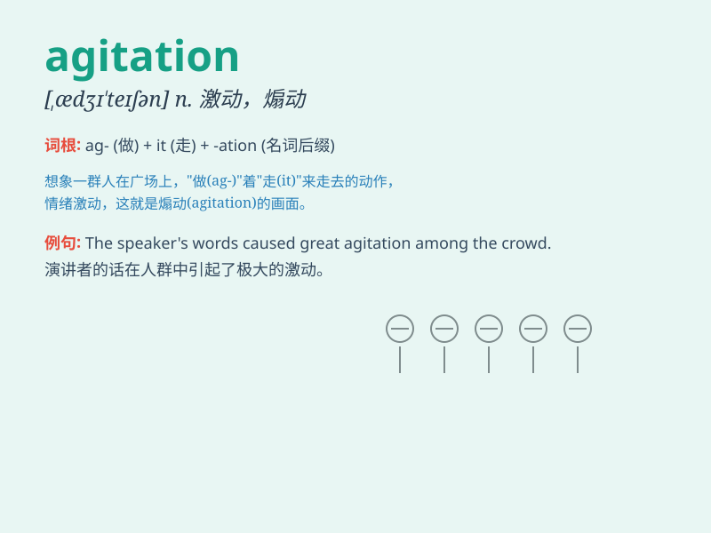

## agitation

**英音:** _[ædʒɪ\'teɪʃ(ə)n]_ **美音:** _[,ædʒɪ\'teʃən]_

**译义:** *n.激动,兴奋,煽动,搅动*

### 短语

+ **mental agitation:** _精神不安_

+ **political agitation:** _政治鼓动_

+ **constant agitation:** _持续的搅动_

+ **agitation for reform:** _改革的鼓动_

+ **agitation of the liquid:** _液体的搅动_

### 例句

#### 例句1

> **The news caused a great deal of agitation among the public.**

**中文翻译:** 这则新闻在公众中引起了极大的不安。

**单词释义:** 不安；焦虑

#### 例句2

> **His speech was full of political agitation.**

**中文翻译:** 他的演讲充满了政治煽动。

**单词释义:** 煽动；鼓动

#### 例句3

> **The patient was in a state of agitation after the operation.**

**中文翻译:** 手术后病人处于焦虑不安的状态。

**单词释义:** 焦虑；躁动

### 背诵小故事

> A group of people were protesting on the street. Their voices were
filled with agitation as they shouted for justice. The commotion and
unrest showed their strong emotions and eagerness for change.

**一群人正在街上抗议。他们的声音中充满了激动，大声呼喊着要求正义。这种骚乱和不安显示出他们强烈的情感和对变革的渴望。**

### 图义

