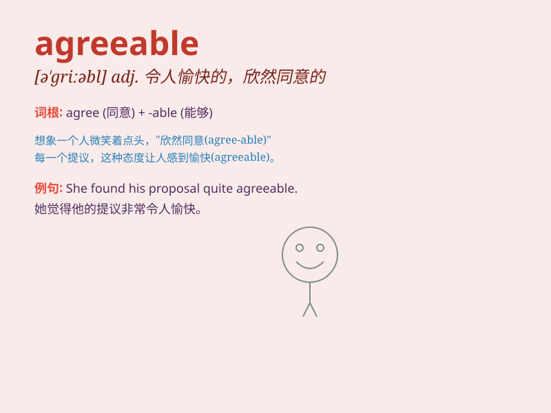

## agreeable

**英音:** _[ə\'griːəb(ə)l]_ **美音:** _[ə\'ɡriəbl]_

**译义:** *adj.使人愉快的,惬意的,适合的*

### 短语

+ **agreeable climate:** _宜人的气候_

+ **agreeable person:** _讨人喜欢的人_

+ **agreeable smell:** _好闻的气味_

+ **agreeable solution:** _令人满意的解决方案_

+ **agreeable taste:** _可口的味道_

### 例句

#### 例句1

> **The weather is agreeable today, perfect for a picnic.**

**中文翻译:** 今天的天气宜人，非常适合野餐。

**单词释义:** 宜人的；令人愉快的

#### 例句2

> **She has an agreeable personality and gets along well with
everyone.**

**中文翻译:** 她性格随和，和每个人都相处得很好。

**单词释义:** 随和的；讨人喜欢的

#### 例句3

> **The music at the party was agreeable to the ears.**

**中文翻译:** 聚会上的音乐悦耳动听。

**单词释义:** 悦耳的；惬意的

### 背诵小故事

> One day, I went on a picnic with my friends. The weather was
agreeable. We had a great time chatting and laughing. It means pleasant
and enjoyable. The picnic was so agreeable that we all wanted to do it
again.

**有一天，我和朋友们去野餐。天气宜人。我们愉快地聊天、大笑。它意味着令人愉快的、惬意的。这次野餐如此惬意，我们都想再来一次。**

### 图义

