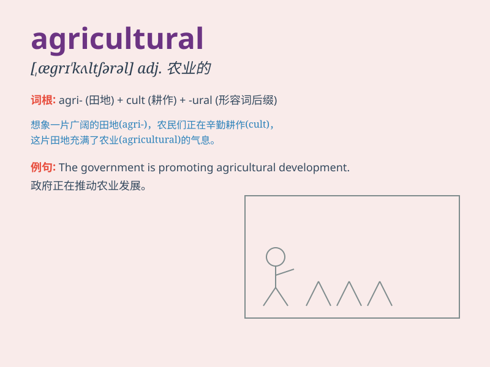

## agricultural

**英音:** _[æɡrɪ\'kʌltʃərəl]_ **美音:**
_[,ægrɪ\'kʌltʃərəl]_

**译义:** *adj.农业的,农艺的*

### 短语

+ **agricultural products:** _农产品_

+ **agricultural machinery:** _农业机械_

+ **agricultural land:** _农业用地_

+ **agricultural development:** _农业发展_

+ **agricultural sector:** _农业部门_

### 例句

#### 例句1

> **The country has a strong agricultural sector.**

**中文翻译:** 这个国家有强大的农业部门。

**单词释义:** 农业的

#### 例句2

> **Agricultural products are in high demand worldwide.**

**中文翻译:** 农产品在全球范围内需求旺盛。

**单词释义:** 农业的

#### 例句3

> **She studied agricultural science at university.**

**中文翻译:** 她在大学学习农业科学。

**单词释义:** 农业的

### 背诵小故事

> A young farmer dreams of making his agricultural land the most
productive. He works hard, using new methods, and finally his
agricultural products are loved by everyone.

**一位年轻的农民梦想着让他的农田成为产量最高的。他努力工作，采用新方法，最终他的农产品受到了大家的喜爱。**

### 图义

