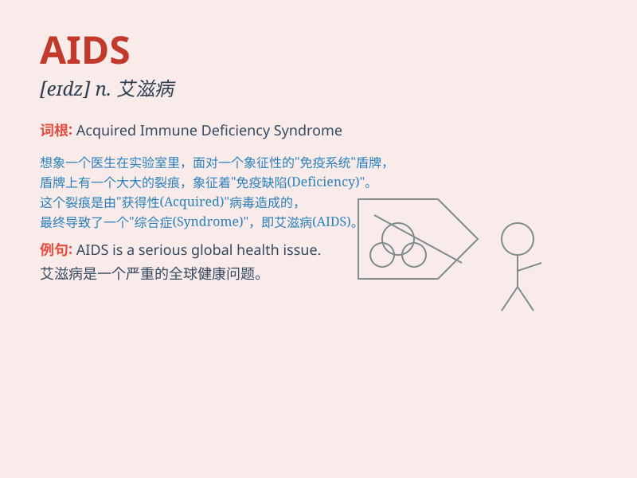

## AIDS

**英音:** _[eɪdz]_ **美音:** _[eɪdz]_

**译义:** *n. 艾滋病（Acquired Immune Deficiency
Syndrome的缩写），一种由人类免疫缺陷病毒（HIV）引起的严重免疫系统疾病，导致患者容易感染其他疾病。*

### 短语

+ **AIDS patient:** _艾滋病患者_

+ **AIDS awareness:** _艾滋病意识_

+ **AIDS prevention:** _艾滋病预防_

+ **AIDS research:** _艾滋病研究_

+ **AIDS epidemic:** _艾滋病流行_

### 例句

#### 例句1

> **AIDS has become a major global health concern.**

**中文翻译:** 艾滋病已经成为全球主要的健康问题。

**单词释义:** 艾滋病

#### 例句2

> **She is dedicated to raising awareness about AIDS.**

**中文翻译:** 她致力于提高人们对艾滋病的认识。

**单词释义:** 艾滋病

#### 例句3

> **The research on AIDS has made significant progress in recent
years.**

**中文翻译:** 近年来，关于艾滋病的研究取得了重大进展。

**单词释义:** 艾滋病

### 背诵小故事

> 想象一个超级英雄，他的任务是对抗一种叫 AIDS 的邪恶力量。AIDS
非常狡猾，总是试图伤害人们的健康。但超级英雄勇敢地与之斗争，提醒大家要小心防范它。

**想象一个超级英雄与被称为艾滋病的邪恶力量作斗争的故事，以帮助记住
AIDS 这个单词，同时提醒大家注意防范艾滋病。**

### 图义

