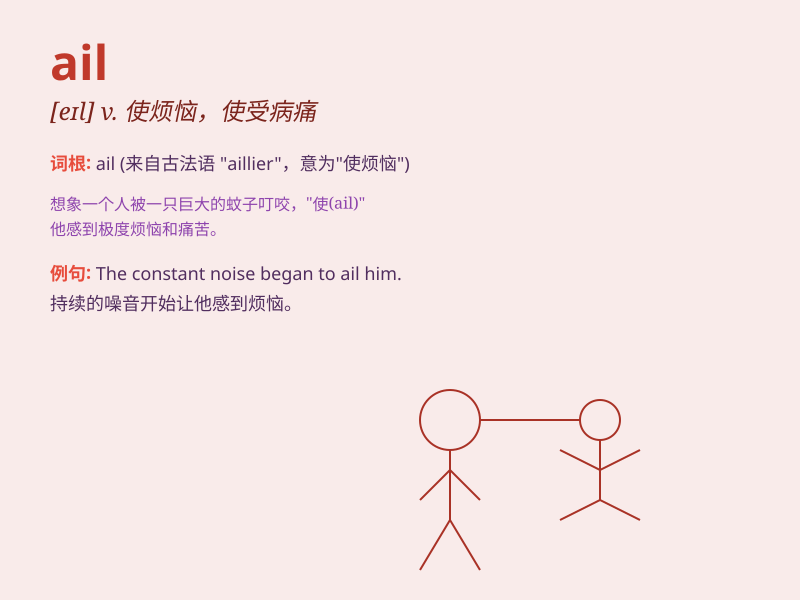

## ail

**英音:** _[eɪl]_ **美音:** _[el]_

**译义:** *vt.折磨,使疼痛,使烦恼*

### 短语

+ **ail from:** _因\...而苦恼_

+ **be ailing:** _生病；身体不适_

+ **ail something:** _使某物受病痛折磨；损害某物_

+ **mental ails:** _精神上的病痛_

+ **chronic ails:** _慢性疾病_

### 例句

#### 例句1

> **I think she\'s ailing. **

**中文翻译:** 我觉得她生病了。

**单词释义:** 生病；感到不适

#### 例句2

> **What ails him? **

**中文翻译:** 他怎么了？

**单词释义:** 使苦恼；使不适

#### 例句3

> **The economy continues to ail. **

**中文翻译:** 经济持续萎靡不振。

**单词释义:** （发展）受阻；（情况）不佳

### 背诵小故事

> A little fairy was ill. Her wings ailed and she couldn\'t fly.
Everyone was worried. But with love and care, she finally got better.
Remember, \'ail\' means to be ill or have problems.

**一个小仙女生病了。她的翅膀出了问题，她飞不起来了。大家都很担心。但在爱和关怀下，她最终好了起来。记住，\'ail\'意思是生病或有问题。**

### 图义

