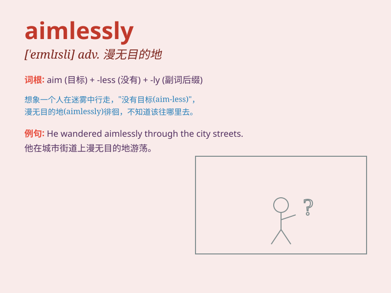

## aimlessly

**英音:** _[ˈeɪmlɪsli]_ **美音:** _[ˈeɪmləsli]_

**译义:** *adv.漫无目的地,没目标地*

### 短语

+ **wander aimlessly:** _漫无目的地徘徊_

+ **drift aimlessly:** _漫无目的地漂流_

+ **search aimlessly:** _漫无目的地寻找_

+ **move aimlessly:** _漫无目的地移动_

+ **roam aimlessly:** _漫无目的地漫游_

### 例句

#### 例句1

> **He wandered aimlessly through the streets.**

**中文翻译:** 他在街上漫无目的地徘徊。

**单词释义:** 漫无目的地

#### 例句2

> **She stared aimlessly out of the window.**

**中文翻译:** 她漫无目的地凝视着窗外。

**单词释义:** 漫无目的地

#### 例句3

> **They drove aimlessly around the countryside.**

**中文翻译:** 他们在乡下漫无目的地开车兜风。

**单词释义:** 漫无目的地

### 背诵小故事

> A lost traveler was walking aimlessly in the forest. He had no
destination and just wandered around, not knowing where to go. Finally,
he realized that aimlessly moving wouldn\'t lead him anywhere.

**一位迷路的旅行者在森林里漫无目的地走着。他没有目的地，只是四处游荡，不知道该往哪儿走。最后，他意识到漫无目的地走不会带他去任何地方。**

### 图义

