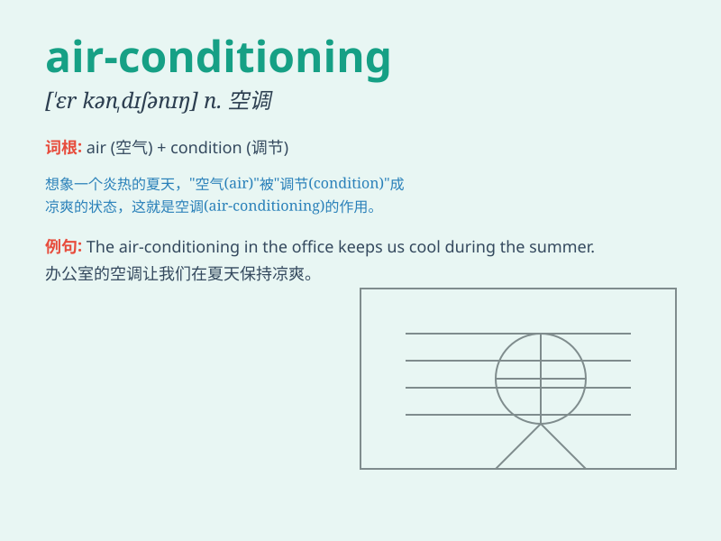

## air-conditioning

**英音:** _[ɛə-kən\'dɪʃənɪŋ]_ **美音:**
_[er-kən\'dɪʃənɪŋ]_

**译义:** *n.空调设备，空调系统；空气调节*

### 短语

+ **central air-conditioning:** _中央空调_

+ **air-conditioning system:** _空调系统_

+ **portable air-conditioning:** _便携式空调_

+ **industrial air-conditioning:** _工业空调_

+ **vehicle air-conditioning:** _车载空调_

### 例句

#### 例句1

> **The office is equipped with advanced air-conditioning
systems.**

**中文翻译:** 办公室配备了先进的空调系统。

**单词释义:** 空调系统

#### 例句2

> **We need to repair the air-conditioning in our car.**

**中文翻译:** 我们需要修理我们车里的空调。

**单词释义:** 空调

#### 例句3

> **The air-conditioning in this shopping mall is very powerful.**

**中文翻译:** 这个购物中心的空调非常强劲。

**单词释义:** 空调

### 背诵小故事

> In a hot summer, Tom was sweating a lot. Then he entered a room with
amazing air-conditioning. It was so cool and comfortable. The
air-conditioning made the air fresh and pleasant, and Tom felt relaxed
immediately.

**在一个炎热的夏天，汤姆大汗淋漓。然后他走进一个有很棒空调的房间。房间里非常凉爽舒适。空调让空气清新宜人，汤姆立刻感到放松了。**

### 图义

