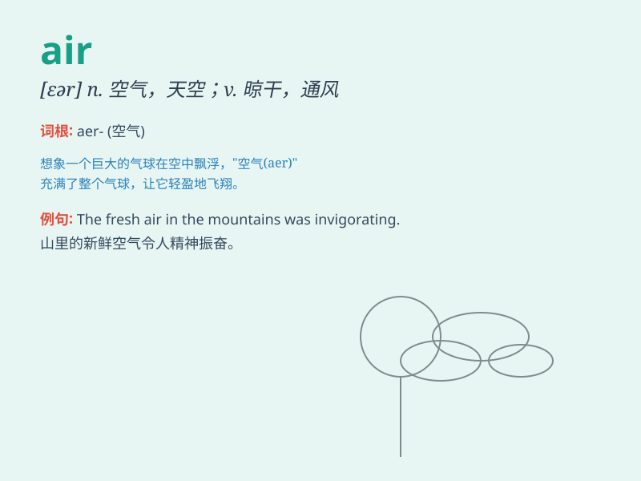

## air

**英音:** _[eə]_ **美音:** _[ɛr]_

**译义:**
*n.空气,样子,天空,空中,曲调vt.晾干,使通风,宣扬,夸耀,显示*

### 短语

+ **air conditioning:** _空调；空气调节_

+ **in the air:** _在空中；悬而未决_

+ **fresh air:** _新鲜空气_

+ **air pollution:** _空气污染_

+ **by air:** _乘飞机_

### 例句

#### 例句1

> **The room was filled with fresh air.**

**中文翻译:** 这个房间充满了新鲜的空气。

**单词释义:** 空气

#### 例句2

> **She aired the quilt in the sun.**

**中文翻译:** 她在太阳下晒被子。

**单词释义:** 晾晒；通风

#### 例句3

> **The program will be aired on TV tonight.**

**中文翻译:** 这个节目今晚将在电视上播出。

**单词释义:** 播出；播送

### 背诵小故事

> A bird is flying freely in the air. It enjoys the fresh air and the
beautiful view. The air is so clean and makes the bird feel happy and
energetic.

**一只鸟在空中自由飞翔。它享受着新鲜的空气和美丽的景色。空气如此清新，让这只鸟感到快乐和充满活力。**

### 图义

