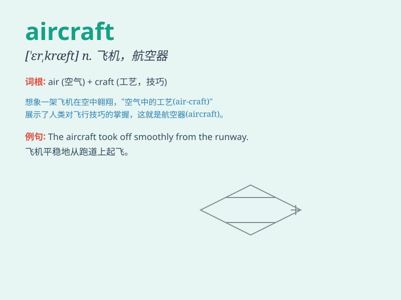

## aircraft

**英音:** _[\'eəkrɑːft]_ **美音:** _[\'ɛr\'kræft]_

**译义:** *n.航行器*

### 短语

+ **military aircraft:** _军用飞机_

+ **civil aircraft:** _民用飞机_

+ **passenger aircraft:** _客机_

+ **aircraft carrier:** _航空母舰_

+ **light aircraft:** _轻型飞机_

### 例句

#### 例句1

> **The aircraft was damaged during the landing.**

**中文翻译:** 这架飞机在着陆时受损了。

**单词释义:** 飞机

#### 例句2

> **Military aircraft flew over the city.**

**中文翻译:** 军用飞机飞过了这座城市。

**单词释义:** 飞机

#### 例句3

> **The new aircraft is more fuel-efficient.**

**中文翻译:** 这架新飞机更省油。

**单词释义:** 飞机

### 背诵小故事

> One day, a little boy was playing with his toy planes. He called them
\'aircraft\'. He imagined these aircraft flying high in the sky,
carrying passengers to different places. The word \'aircraft\' stuck in
his mind.

**有一天，一个小男孩在玩他的玩具飞机。他称它们为"飞机"。他想象这些飞机在高空飞翔，载着乘客去不同的地方。"aircraft"这个词就留在了他的脑海里。**

### 图义

