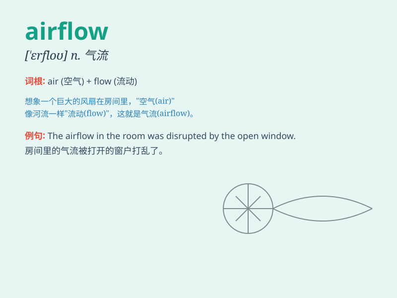

## airflow

**英音:** _[\'eəfləʊ]_ **美音:** _[\'ɛrflo]_

**译义:** *n.气流*

### 短语

+ **airflow rate:** _气流速率_

+ **airflow sensor:** _气流传感器_

+ **optimal airflow:** _最佳气流_

+ **uneven airflow:** _不均匀气流_

+ **control airflow:** _控制气流_

### 例句

#### 例句1

> **The airflow in the room was poor, making it stuffy.**

**中文翻译:** 房间里的气流不畅，使得房间很闷。

**单词释义:** 气流

#### 例句2

> **The design of the car aims to optimize the airflow and reduce
drag.**

**中文翻译:** 这款汽车的设计旨在优化气流并减少阻力。

**单词释义:** 气流

#### 例句3

> **The airflow from the fan cooled the hot room quickly.**

**中文翻译:** 风扇产生的气流很快让炎热的房间凉快下来。

**单词释义:** 气流

### 背诵小故事

> Imagine a magical factory where toys are made. The gentle movement of
the fresh air as it passes through the factory, helping the machines
work smoothly, is like the \'airflow\'. It\'s the smooth and continuous
flow of air.

**想象一个神奇的工厂，里面正在制造玩具。清新空气轻柔地穿过工厂，帮助机器平稳运行，这就像是\'airflow\'。它指的是空气平稳且持续的流动。**

### 图义

