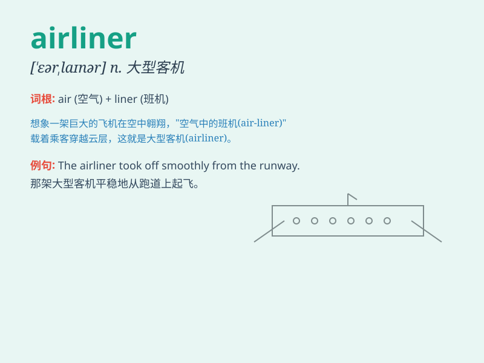

## airliner

**英音:** _[\'eəlaɪnə]_ **美音:** _[\'ɛrlaɪnɚ]_

**译义:** *n.定期班机,客机*

### 短语

+ **passenger airliner:** _客机_

+ **domestic airliner:** _国内航班客机_

+ **international airliner:** _国际航班客机_

+ **jet airliner:** _喷气式客机_

+ **long-haul airliner:** _长途客机_

### 例句

#### 例句1

> **The airliner took off smoothly from the runway.**

**中文翻译:** 这架客机从跑道上平稳起飞。

**单词释义:** 客机

#### 例句2

> **The new airliner offers more comfortable seats and better
entertainment systems.**

**中文翻译:** 这架新客机提供了更舒适的座位和更好的娱乐系统。

**单词释义:** 客机

#### 例句3

> **Due to bad weather, the airliner was delayed for several
hours.**

**中文翻译:** 由于恶劣天气，这架客机延误了几个小时。

**单词释义:** 客机

### 背诵小故事

> One day, I dreamt of being a pilot on an airliner. I flew through the
clouds, carrying passengers safely to their destinations. The huge
airliner was like a magic bird in the sky.

**有一天，我梦到自己成为一架客机的飞行员。我穿越云层，将乘客安全地送达目的地。这架巨大的客机就像天空中的神奇大鸟。**

### 图义

