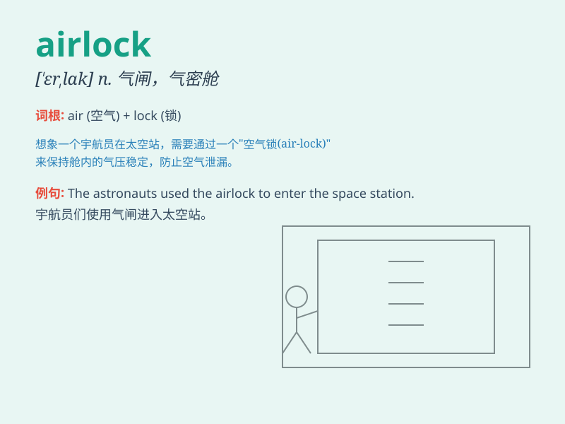

## airlock

**英音:** _[ˈeəlɒk]_ **美音:** _[ˈerlɑːk]_

**译义:** *n.（航天器等的）气闸；密封舱；减压室*

### 短语

+ **airlock chamber:** _气闸室_

+ **space airlock:** _太空气闸_

+ **airlock system:** _气闸系统_

+ **airlock door:** _气闸门_

+ **pressure airlock:** _压力气闸_

### 例句

#### 例句1

> **The spaceship has an airlock to allow astronauts to enter and
exit safely.**

**中文翻译:** 这艘宇宙飞船有一个气闸，以允许宇航员安全地进出。

**单词释义:** 气闸

#### 例句2

> **The divers passed through the airlock to reach the underwater
cave.**

**中文翻译:** 潜水员穿过气闸到达水下洞穴。

**单词释义:** 气闸

#### 例句3

> **The airlock malfunctioned, causing a delay in the mission.**

**中文翻译:** 气闸发生故障，导致任务延误。

**单词释义:** 气闸

### 背诵小故事

> A brave astronaut was on a space mission. When entering the
spaceship, he had to go through a special room called an airlock to
adjust the pressure. The airlock protected him from the harsh vacuum of
space.

**一位勇敢的宇航员正在执行太空任务。当进入飞船时，他必须穿过一个叫做气闸室的特殊房间来调节压力。气闸室保护他免受太空的恶劣真空环境影响。**

### 图义

