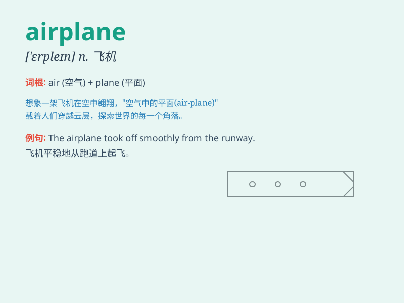

## airplane

**英音:** _[\'eəpleɪn]_ **美音:** _[ˈɛrplen]_

**译义:** *n.飞机*

### 短语

+ **by airplane:** _乘飞机_

+ **take an airplane:** _乘坐飞机_

+ **board an airplane:** _登机_

+ **airplane crash:** _飞机坠毁_

+ **airplane ticket:** _飞机票_

### 例句

#### 例句1

> **The airplane took off smoothly from the runway.**

**中文翻译:** 这架飞机从跑道上平稳起飞。

**单词释义:** 飞机

#### 例句2

> **We saw many airplanes in the sky during the air show.**

**中文翻译:** 在航空展期间，我们在空中看到了许多飞机。

**单词释义:** 飞机

#### 例句3

> **The passengers were waiting to board the airplane.**

**中文翻译:** 乘客们正等着登上飞机。

**单词释义:** 飞机

### 背诵小故事

> One day, a little boy was playing in the park. Suddenly, he saw an
airplane flying high in the sky. The airplane had big wings and made a
loud noise. The boy was so excited and shouted, \'Look at that
airplane!\'

**一天，一个小男孩在公园玩耍。突然，他看到一架飞机在高空飞行。这架飞机有大大的机翼，还发出很大的噪音。小男孩非常兴奋，大喊道："看那架飞机！"**

### 图义

