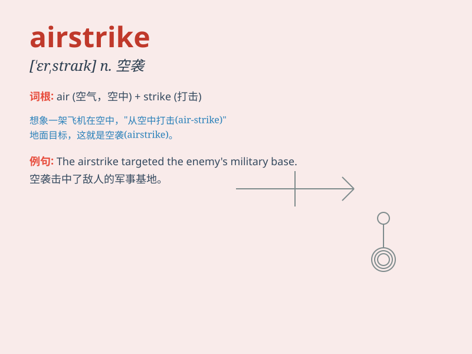

## airstrike

**英音:** _[ˈeəˌstraɪk]_ **美音:** _[ˈerˌstraɪk]_

**译义:** *n. 空袭，空中打击*

### 短语

+ **airstrike target:** _空袭目标_

+ **launch an airstrike:** _发动空袭_

+ **prevent an airstrike:** _阻止空袭_

+ **survive an airstrike:** _在空袭中幸存_

+ **airstrike warning:** _空袭警报_

### 例句

#### 例句1

> **The enemy launched an airstrike on our military base.**

**中文翻译:** 敌人对我们的军事基地发动了空袭。

**单词释义:** 空袭

#### 例句2

> **The government ordered an airstrike to destroy the terrorist
camp.**

**中文翻译:** 政府下令进行空袭以摧毁恐怖分子营地。

**单词释义:** 空袭

#### 例句3

> **Residents were warned of a possible airstrike in the area.**

**中文翻译:** 居民们被警告该地区可能会有空袭。

**单词释义:** 空袭

### 背诵小故事

> In a war-torn land, the enemy launched an airstrike. Planes roared in
the sky and dropped bombs, causing chaos and destruction. But our brave
soldiers were ready to defend. Remember \'airstrike\' as the terrifying
attack from the air.

**在一片战乱之地，敌人发动了空袭。飞机在天空轰鸣，投掷炸弹，造成混乱和破坏。但我们勇敢的士兵已准备好防御。把'airstrike'记为来自空中的可怕攻击。**

### 图义

