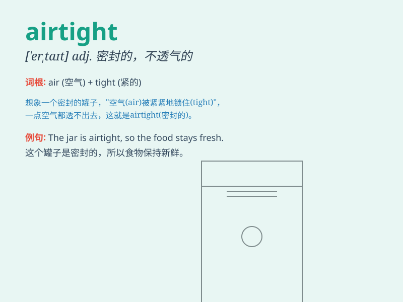

## airtight

**英音:** _[\'eətaɪt]_ **美音:** _[\'ɛrtaɪt]_

**译义:** *adj.密封的,无懈可击的*

### 短语

+ **airtight container:** _密封容器_

+ **airtight seal:** _气密密封_

+ **airtight argument:** _无懈可击的论点_

+ **airtight room:** _密封的房间_

+ **airtight plan:** _周密的计划_

### 例句

#### 例句1

> **The food was stored in an airtight container to keep it
fresh.**

**中文翻译:** 食物被储存在一个密封容器中以保持新鲜。

**单词释义:** 密封的；不透气的

#### 例句2

> **The windows were made airtight to prevent drafts.**

**中文翻译:** 窗户被做得密封以防风。

**单词释义:** 密封的；气密的

#### 例句3

> **This suitcase is supposed to be airtight and waterproof.**

**中文翻译:** 这个手提箱应该是密封且防水的。

**单词释义:** 密封的；不透水的

### 背诵小故事

> A thief wanted to steal from a room filled with treasures. But the
door was airtight, not even a tiny bit of air could get in or out. So,
the thief had no chance. Remember, \'airtight\' means no air can pass
through.

**一个小偷想从一个装满财宝的房间偷东西。但那扇门是密封的，一点儿空气都进不去出不来。所以，小偷没有机会。记住，'airtight'意思是密封的，不透气的。**

### 图义

