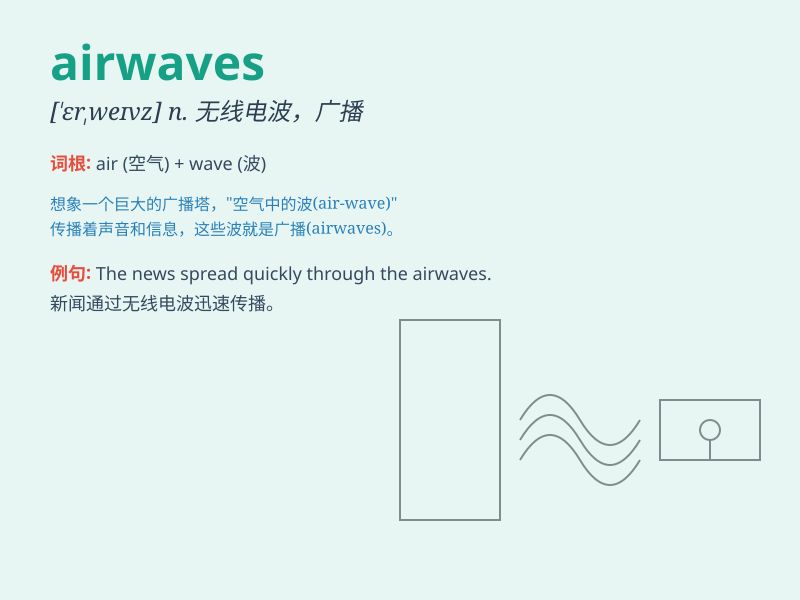

## airwaves

**英音:** _[ˈeəweɪvz]_ **美音:** _[ˈerweɪvz]_

**译义:** * 电视广播*

### 短语

+ **hit the airwaves:** _开始播出_

+ **dominate the airwaves:** _主宰电波_

+ **fill the airwaves:** _充斥电波_

+ **take to the airwaves:** _通过广播讲话_

+ **off the airwaves:** _停止广播_

### 例句

#### 例句1

> **The singer\'s new song is dominating the airwaves.**

**中文翻译:** 这位歌手的新歌在广播中占据主导地位。

**单词释义:** 广播频道；电波

#### 例句2

> **His speech was broadcast on the airwaves.**

**中文翻译:** 他的演讲通过电波广播出去了。

**单词释义:** 电波

#### 例句3

> **The news spread quickly through the airwaves.**

**中文翻译:** 这条新闻通过电波迅速传播开来。

**单词释义:** 电波；广播频道

### 背诵小故事

> A brave pilot was flying through the airwaves. He communicated with
the control tower, sharing his experiences. The airwaves carried his
voice, ensuring a safe journey. The airwaves were like a magical path in
the sky.

**一位勇敢的飞行员正在电波中飞行。他与控制塔台交流，分享着他的经历。电波传送着他的声音，确保了安全的旅程。电波就像天空中神奇的路径。**

### 图义

