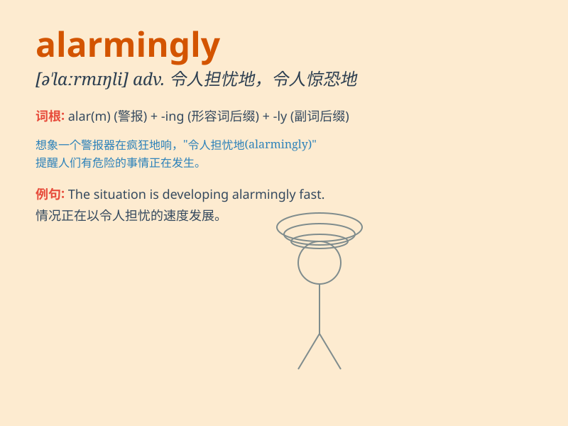

## alarmingly

**英音:** _[əˈlɑːmɪŋli]_ **美音:** _[əˈlɑrmɪŋli]_

**译义:** *adv.令人担忧地，令人惊恐地*

### 短语

+ **alarmingly high:** _高得惊人_

+ **alarmingly fast:** _快得惊人_

+ **alarmingly low:** _低得惊人_

+ **alarmingly frequent:** _频繁得惊人_

+ **alarmingly serious:** _严重得惊人_

### 例句

#### 例句1

> **The crime rate is increasing alarmingly.**

**中文翻译:** 犯罪率正在惊人地增长。

**单词释义:** 惊人地

#### 例句2

> **Her health deteriorated alarmingly fast.**

**中文翻译:** 她的健康状况恶化得惊人地快。

**单词释义:** 惊人地

#### 例句3

> **The cost of living has risen alarmingly in recent years.**

**中文翻译:** 近年来，生活成本惊人地上涨。

**单词释义:** 惊人地

### 背诵小故事

> A town was peaceful until one day, a strange noise occurred
alarmingly. Everyone was scared. But a brave boy found it was just a
prank. The frequency of such scary but false alarms was alarmingly high.

**一个小镇原本很平静，直到有一天，一阵奇怪的噪音惊人地响起。大家都很害怕。但一个勇敢的男孩发现这只是个恶作剧。这种吓人但虚假的警报频率高得惊人。**

### 图义

