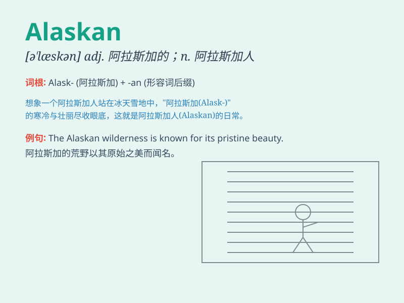

## Alaskan

**英音:** _[əˈlæskən]_ **美音:** _[əˈlæskən]_

**译义:** *adj.阿拉斯加的;阿拉斯加人的 n.阿拉斯加人*

### 短语

+ **Alaskan malamute:** _阿拉斯加雪橇犬_

+ **Alaskan king crab:** _阿拉斯加帝王蟹_

+ **Alaskan oil pipeline:** _阿拉斯加输油管道_

+ **Alaskan wilderness:** _阿拉斯加荒野_

+ **Alaskan Eskimo:** _阿拉斯加爱斯基摩人_

### 例句

#### 例句1

> **The Alaskan landscape is breathtakingly beautiful.**

**中文翻译:** 阿拉斯加的风景美得令人惊叹。

**单词释义:** 阿拉斯加的；阿拉斯加人的

#### 例句2

> **An Alaskan fisherman has a tough life.**

**中文翻译:** 一位阿拉斯加渔民的生活很艰苦。

**单词释义:** 阿拉斯加的；阿拉斯加人的

#### 例句3

> **The Alaskan malamute is a strong and intelligent dog breed.**

**中文翻译:** 阿拉斯加雪橇犬是一种强壮且聪明的犬种。

**单词释义:** 阿拉斯加的

### 背诵小故事

> One day, an Alaskan adventurer was lost in the snowy mountains. But
with his strong will and knowledge of the land, he finally found his way
home. The Alaskan landscape is both beautiful and challenging.

**有一天，一位阿拉斯加的冒险家在雪山中迷路了。但凭借坚强的意志和对这片土地的了解，他最终找到了回家的路。阿拉斯加的风景既美丽又充满挑战。**

### 图义

