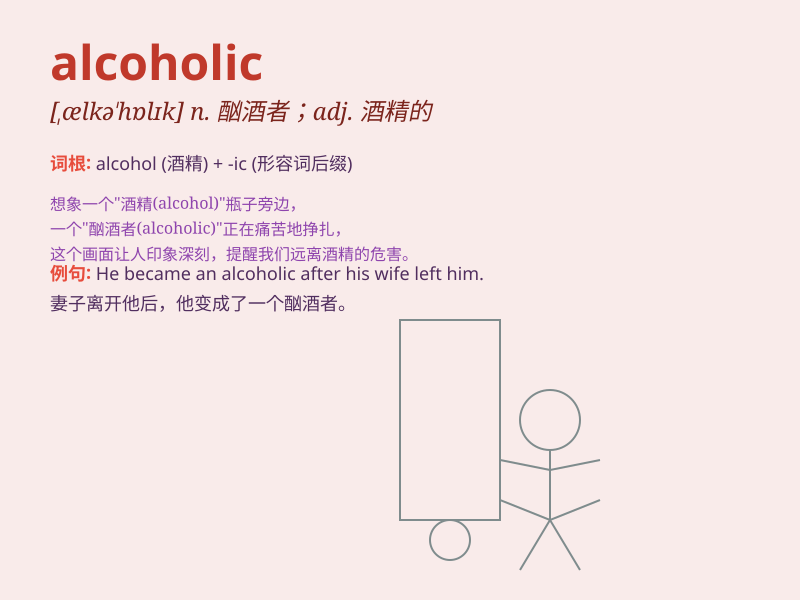

## alcoholic

**英音:** _[ælkə\'hɒlɪk]_ **美音:** _[,ælkə\'hɔlɪk]_

**译义:** *adj.含酒精的n.酗酒者,酒鬼*

### 短语

+ **chronic alcoholic:** _慢性酒精中毒者_

+ **alcoholic beverage:** _酒精饮料_

+ **alcoholic drink:** _含酒精的饮料_

+ **alcoholic solution:** _酒精溶液_

+ **recovering alcoholic:** _正在康复的酗酒者_

### 例句

#### 例句1

> **He has been an alcoholic for years and is struggling to quit.**

**中文翻译:** 他酗酒多年，一直在努力戒酒。

**单词释义:** 酗酒者；酒鬼

#### 例句2

> **Alcoholic beverages are not allowed in this school.**

**中文翻译:** 这所学校不允许有酒精饮料。

**单词释义:** 含酒精的；酒精的

#### 例句3

> **She has an alcoholic father who often causes trouble at home.**

**中文翻译:** 她有个酗酒的父亲，经常在家里惹麻烦。

**单词释义:** 酗酒的；酒精中毒的

### 背诵小故事

> One day, Tom was at a party. He drank a lot of alcohol and couldn\'t
stop. From then on, he became an alcoholic, always seeking alcohol and
unable to control himself.

**一天，汤姆在一个派对上。他喝了很多酒并且停不下来。从那以后，他变成了一个酒鬼，总是找酒喝并且无法控制自己。**

### 图义

