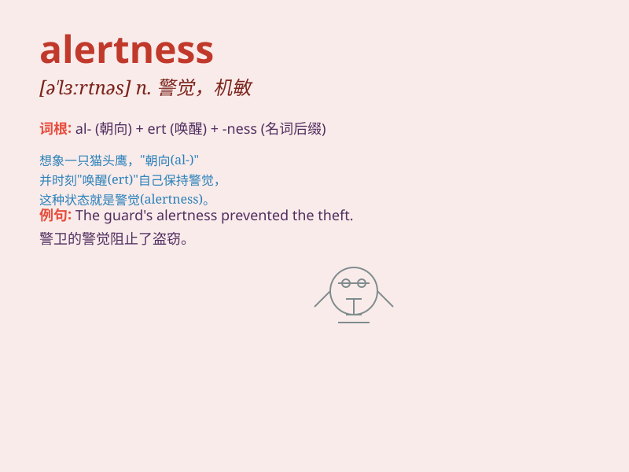

## alertness

**英音:** _[ə\'lɜːtnəs]_ **美音:** _[ə\'lɝtnɪs]_

**译义:** *n.警戒,机敏*

### 短语

+ **heighten alertness:** _提高警觉_

+ **maintain alertness:** _保持警觉_

+ **sharp alertness:** _敏锐的警觉_

+ **constant alertness:** _持续的警觉_

+ **enhance alertness:** _增强警觉_

### 例句

#### 例句1

> **His alertness allowed him to spot the danger in time.**

**中文翻译:** 他的警觉使他及时发现了危险。

**单词释义:** 警觉

#### 例句2

> **The soldier\'s alertness was crucial during the night watch.**

**中文翻译:** 在夜间站岗时，士兵的警觉性至关重要。

**单词释义:** 警觉性

#### 例句3

> **Lack of sleep affected her alertness at work.**

**中文翻译:** 睡眠不足影响了她工作时的警觉程度。

**单词释义:** 警觉程度

### 背诵小故事

> One day, a detective was on a mission. His alertness saved the day
when he noticed a tiny clue that others missed. He stayed sharp and
focused, and that\'s what alertness means - being watchful and quick to
notice things.

**有一天，一位侦探在执行任务。他的警觉性挽救了局面，因为他注意到了一个别人错过的小线索。他保持敏锐和专注，这就是'alertness'的意思------警惕，能迅速注意到事物。**

### 图义

