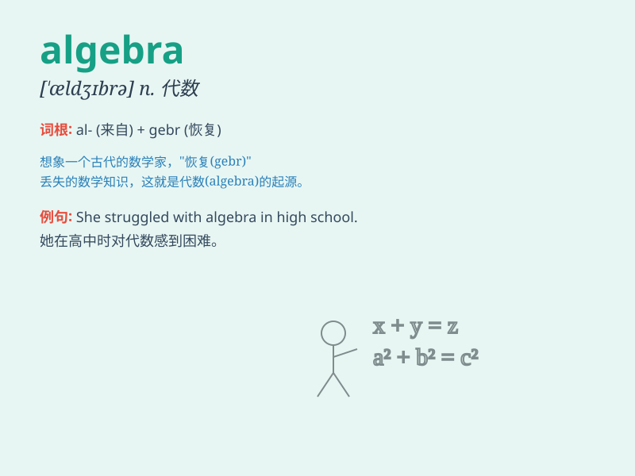

## algebra

**英音:** _[\'ældʒɪbrə]_ **美音:** _[\'ældʒɪbrə]_

**译义:** *n.代数学*

### 短语

+ **linear algebra:** _线性代数_

+ **abstract algebra:** _抽象代数_

+ **elementary algebra:** _初等代数_

+ **algebra equation:** _代数方程_

+ **algebraic expression:** _代数表达式_

### 例句

#### 例句1

> **I always struggled with algebra in high school.**

**中文翻译:** 我在高中时总是学不好代数。

**单词释义:** 代数

#### 例句2

> **She is taking an advanced algebra course this semester.**

**中文翻译:** 这学期她正在上一门高等代数课程。

**单词释义:** 代数

#### 例句3

> **Algebra is an important foundation for higher mathematics.**

**中文翻译:** 代数是高等数学的重要基础。

**单词释义:** 代数

### 背诵小故事

>
从前有个聪明的学生，在数学课堂上努力学习一种神奇的知识叫\'algebra\'，它能帮助解决各种复杂的方程问题。通过不断练习，学生终于掌握了它，在数学世界里畅游。

**从前有个聪明的学生，在数学课堂上努力学习代数，它能帮助解决各种复杂的方程问题。通过不断练习，学生终于掌握了代数，在数学世界里畅游。**

### 图义

