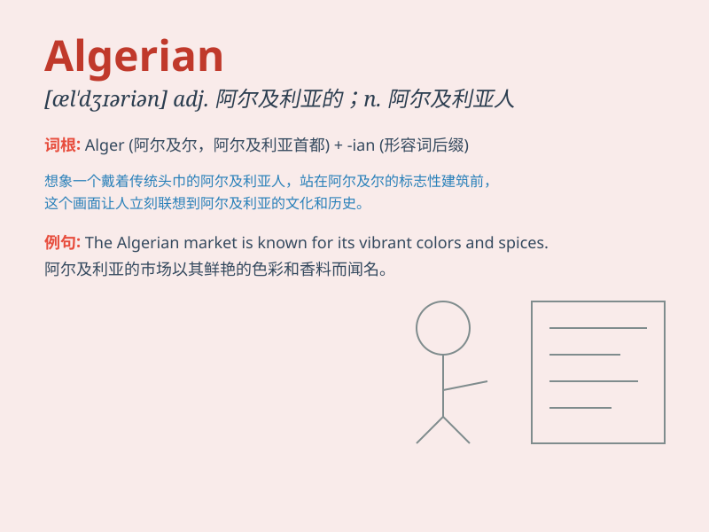

## Algerian

**英音:** _[ˌældʒɪˈreɪ.ən]_ **美音:** _[ˌæl.dʒɪr.i.ən]_

**译义:** *阿尔及利亚的；阿尔及利亚人*

### 短语

+ **Algerian coast:** _阿尔及利亚海岸_

+ **Algerian cuisine:** _阿尔及利亚美食_

+ **Algerian culture:** _阿尔及利亚文化_

+ **Algerian history:** _阿尔及利亚历史_

+ **Algerian people:** _阿尔及利亚人民_

### 例句

#### 例句1

> **The Algerian cuisine is known for its rich flavors.**

**中文翻译:** 阿尔及利亚的美食以其丰富的口味而闻名。

**单词释义:** 阿尔及利亚的；阿尔及利亚人的

#### 例句2

> **She met an Algerian artist at the exhibition.**

**中文翻译:** 她在展览会上遇到了一位阿尔及利亚艺术家。

**单词释义:** 阿尔及利亚的；阿尔及利亚人的

#### 例句3

> **The Algerian flag fluttered in the wind.**

**中文翻译:** 阿尔及利亚国旗在风中飘扬。

**单词释义:** 阿尔及利亚的；阿尔及利亚人的

### 背诵小故事

> A traveler was lost in a strange land. A kind Algerian came to help.
The Algerian guided the traveler and showed great hospitality. The
traveler would never forget this friendly Algerian.

**一位旅行者在陌生的地方迷路了。一位善良的阿尔及利亚人前来帮忙。这位阿尔及利亚人给旅行者指路，并展现出极大的热情好客。旅行者永远不会忘记这位友好的阿尔及利亚人。**

### 图义

