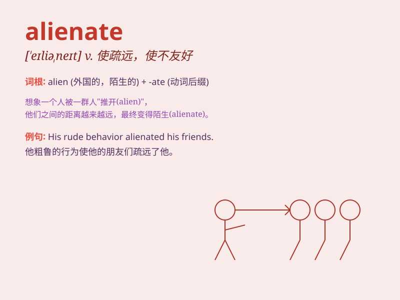

## alienate

**英音:** _[\'eɪlɪəneɪt]_ **美音:** _[elɪənˌet]_

**译义:** *v.疏远*

### 短语

+ **alienate from:** _使疏远；使脱离_

+ **alienate someone\'s affections:** _离间某人的感情_

+ **alienate public opinion:** _失去公众舆论的支持_

+ **alienate the support:** _失去支持_

+ **alienate the hearts of the people:** _失去民心_

### 例句

#### 例句1

> **His behavior alienated his friends.**

**中文翻译:** 他的行为使他的朋友们疏远了他。

**单词释义:** 使疏远

#### 例句2

> **The new policy has alienated many of the company\'s
employees.**

**中文翻译:** 新政策使公司的许多员工感到不满和疏远。

**单词释义:** 使疏远；使不友好

#### 例句3

> **Her cold attitude alienated the customers.**

**中文翻译:** 她冷漠的态度使顾客们感到不满而疏远。

**单词释义:** 使疏远；使失去好感

### 背诵小故事

> A young man always criticized his friends\' hobbies, which made them
feel distant. Gradually, he alienated all his friends. He realized too
late that his behavior was wrong.

**一个年轻人总是批评朋友们的爱好，这让他们感到疏远。渐渐地，他疏远了所有的朋友。他太晚才意识到自己的行为是错误的。**

### 图义

