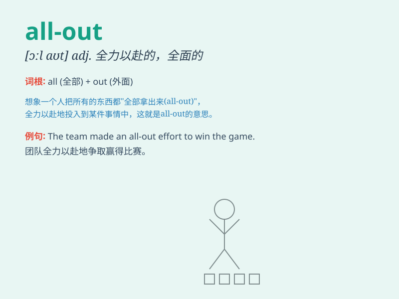

## all-out

**英音:** _[ˌɔːl ˈaʊt]_ **美音:** _[ˌɔːl ˈaʊt]_

**译义:** *adj.全力以赴的；毫无保留的；彻底的*

### 短语

+ **all-out attack:** _全力攻击_

+ **all-out effort:** _全力以赴_

+ **all-out war:** _全面战争_

+ **all-out campaign:** _全力开展的运动_

+ **all-out race:** _全力赛跑_

### 例句

#### 例句1

> **The team made an all-out effort to win the championship.**

**中文翻译:** 这个团队全力以赴去赢得冠军。

**单词释义:** 全力以赴的

#### 例句2

> **We need an all-out attack to solve this problem.**

**中文翻译:** 我们需要全力进攻来解决这个问题。

**单词释义:** 全力的

#### 例句3

> **The company launched an all-out marketing campaign.**

**中文翻译:** 公司发起了一场全面的营销活动。

**单词释义:** 全面的

### 背诵小故事

> A team was in a race. They decided to give an all-out effort. They
ran as fast as they could, used all their strength and skills. Finally,
they won because of this total commitment.

**一个团队正在参加比赛。他们决定全力以赴。他们尽可能快地跑，用尽了所有的力量和技能。最终，因为这种全身心的投入，他们赢了。**

### 图义

