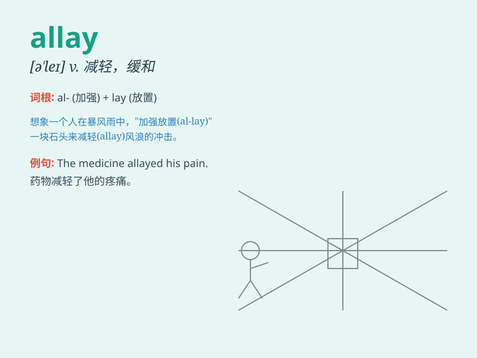

## allay

**英音:** _[ə\'leɪ]_ **美音:** _[ə\'le]_

**译义:** *vt.减轻,减少*

### 短语

+ **allay fears:** _减轻恐惧_

+ **allay concerns:** _消除担忧_

+ **allay anxiety:** _缓解焦虑_

+ **allay hunger:** _缓解饥饿_

+ **allay thirst:** _缓解口渴_

### 例句

#### 例句1

> **The doctor\'s words allayed her fears about the operation.**

**中文翻译:** 医生的话减轻了她对手术的恐惧。

**单词释义:** 减轻；缓和

#### 例句2

> **He tried to allay the public\'s concerns over the new policy.**

**中文翻译:** 他试图减轻公众对新政策的担忧。

**单词释义:** 减轻；消除

#### 例句3

> **The cool breeze allayed the heat of the summer day.**

**中文翻译:** 凉爽的微风缓解了夏日的炎热。

**单词释义:** 缓解；平息

### 背诵小故事

> A king was very worried because his people were in panic. But he
found a way to allay their fears. He gave them food and comfort, making
them calm and peaceful again.

**一位国王非常担忧，因为他的子民处于恐慌之中。但他找到了一种方法来减轻他们的恐惧。他给他们食物和安慰，让他们再次变得平静和安宁。**

### 图义

