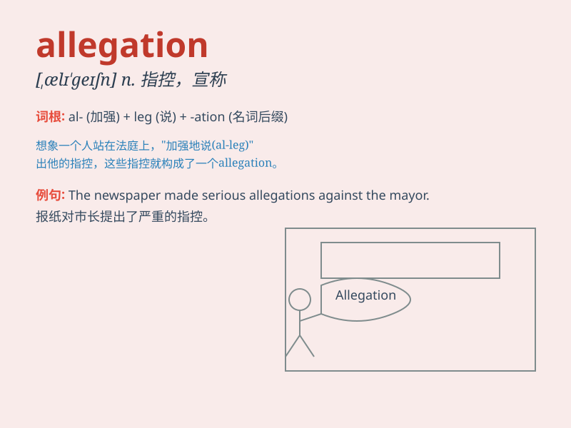

## allegation

**英音:** _[ælɪ\'geɪʃ(ə)n]_ **美音:** _[\'ælə\'geʃən]_

**译义:** *n.主张,断言,辩解*

### 短语

+ **make an allegation:** _提出指控_

+ **false allegation:** _虚假指控_

+ **unfounded allegation:** _毫无根据的指控_

+ **serious allegation:** _严重的指控_

+ **credible allegation:** _可信的指控_

### 例句

#### 例句1

> **The politician faced serious allegations of corruption.**

**中文翻译:** 这位政治家面临严重的腐败指控。

**单词释义:** 指控；陈述，主张

#### 例句2

> **The company denies the allegation that it has violated
environmental regulations.**

**中文翻译:** 该公司否认了其违反环境法规的指控。

**单词释义:** 指控；指责

#### 例句3

> **The police are investigating the allegation of theft.**

**中文翻译:** 警方正在调查盗窃的指控。

**单词释义:** 指控；宣称

### 背诵小故事

> A detective was investigating an allegation that a thief had stolen
precious jewels from a mansion. The word \'allegation\' here means the
claim or assertion that something has happened, often without proof.

**一位侦探正在调查一项指控，说有个小偷从一座豪宅偷走了珍贵的珠宝。这里'allegation'这个词指的是声称或断言某事发生了，通常没有证据。**

### 图义

