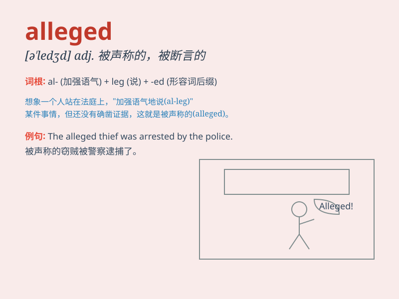

## alleged

**英音:** _[ə\'ledʒd]_ **美音:** _[əˈlɛdʒd]_

**译义:** *adj.声称的,所谓的*

### 短语

+ **alleged crime:** _被指控的罪行_

+ **alleged offender:** _被指称的违法者_

+ **alleged incident:** _所谓的事件_

+ **alleged victim:** _据称的受害者_

+ **alleged misconduct:** _被指称的不当行为_

### 例句

#### 例句1

> **The alleged thief was seen running from the store.**

**中文翻译:** 那个被指称的小偷被看到从商店跑出来。

**单词释义:** 被指称的；涉嫌的

#### 例句2

> **The alleged crime took place last night.**

**中文翻译:** 这起被指控的犯罪发生在昨晚。

**单词释义:** 被指控的；被宣称的

#### 例句3

> **The alleged victim refused to cooperate with the
investigation.**

**中文翻译:** 那位据称的受害者拒绝配合调查。

**单词释义:** 据称的；所谓的

### 背诵小故事

> A detective was investigating an alleged crime. The suspect claimed
innocence, but there was much evidence suggesting otherwise. The word
\'alleged\' here means said or thought to be true but not proved.

**一位侦探正在调查一起据称的犯罪。嫌疑人声称无罪，但有很多证据表明并非如此。这里\'alleged\'这个词的意思是据说或被认为是真实的，但未被证实。**

### 图义

