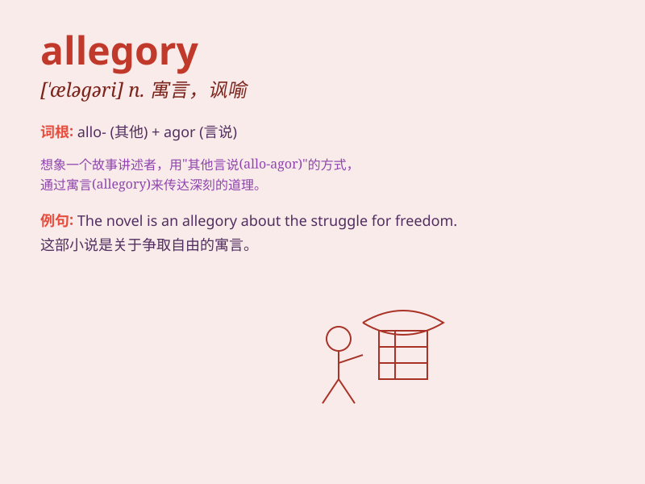

## allegory

**英音:** _[\'ælɪg(ə)rɪ]_ **美音:** _[\'æləɡɔri]_

**译义:** *n.寓言*

### 短语

+ **political allegory:** _政治寓言_

+ **religious allegory:** _宗教寓言_

+ **allegory of love:** _爱情寓言_

+ **moral allegory:** _道德寓言_

+ **symbolic allegory:** _象征寓言_

### 例句

#### 例句1

> **The story of \'Animal Farm\' is an allegory of the Russian
Revolution.**

**中文翻译:** 《动物庄园》的故事是对俄国革命的一个讽喻。

**单词释义:** 讽喻；寓言

#### 例句2

> **This painting is an allegory of good and evil.**

**中文翻译:** 这幅画是善与恶的寓言。

**单词释义:** 寓言；讽喻

#### 例句3

> **The film uses allegory to explore complex social issues.**

**中文翻译:** 这部电影用寓言来探讨复杂的社会问题。

**单词释义:** 寓言；讽喻

### 背诵小故事

> A king\'s strange dream was full of symbols. A wise man explained
that it was an allegory for the kingdom\'s future. The dream wasn\'t
real but carried hidden meanings. Remember, allegory is a story with
hidden meanings.

**一位国王做了一个奇怪的梦，梦里充满了象征。一位智者解释说这是对王国未来的寓言。这个梦不是真实的，但却有着隐藏的含义。记住，allegory
就是有隐藏含义的故事。**

### 图义

