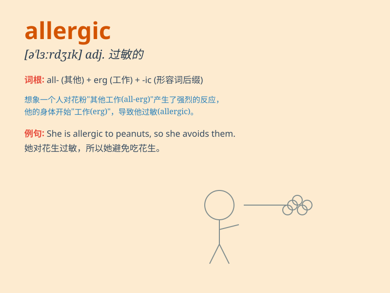

## allergic

**英音:** _[ə\'lɜːdʒɪk]_ **美音:** _[ə\'lɝdʒɪk]_

**译义:** *adj.[医]过敏的,患过敏症的*

### 短语

+ **allergic reaction:** _过敏反应_

+ **allergic rhinitis:** _过敏性鼻炎_

+ **allergic asthma:** _过敏性哮喘_

+ **be allergic to:** _对\...\...过敏_

+ **allergic contact dermatitis:** _过敏性接触性皮炎_

### 例句

#### 例句1

> **I\'m allergic to pollen.**

**中文翻译:** 我对花粉过敏。

**单词释义:** 对\...\...过敏

#### 例句2

> **She is allergic to seafood.**

**中文翻译:** 她对海鲜过敏。

**单词释义:** 对\...\...过敏

#### 例句3

> **Some people are allergic to certain medications.**

**中文翻译:** 有些人对某些药物过敏。

**单词释义:** 对\...\...过敏

### 背诵小故事

> One day, Tom ate a lot of strawberries and suddenly felt very
uncomfortable. He went to the doctor and was told he was allergic to
strawberries. From then on, Tom had to be careful when choosing food.

**有一天，汤姆吃了很多草莓，突然感到非常不舒服。他去看医生，被告知他对草莓过敏。从那以后，汤姆在选择食物时不得不小心。**

### 图义

