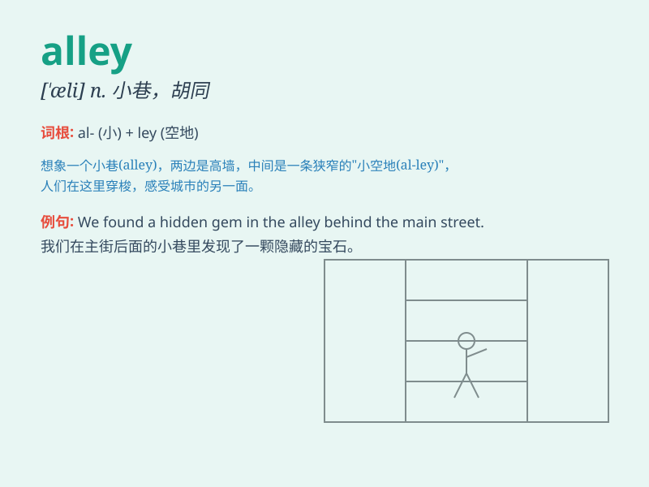

## alley

**英音:** _[\'ælɪ]_ **美音:** _[\'æli]_

**译义:** *n.小路,巷,(花园里两边有树篱的)小径*

### 短语

+ **blind alley:** _死胡同；没有前途的职业_

+ **back alley:** _后巷；偏僻的小巷_

+ **alley cat:** _流浪猫；野猫_

+ **bowling alley:** _保龄球馆；保龄球道_

+ **alley way:** _小巷；胡同；通道_

### 例句

#### 例句1

> **The cat ran into the dark alley.**

**中文翻译:** 这只猫跑进了黑暗的小巷。

**单词释义:** 小巷；胡同

#### 例句2

> **They met in a narrow alley behind the shops.**

**中文翻译:** 他们在商店后面的一条狭窄的小巷里相遇。

**单词释义:** 小巷；胡同

#### 例句3

> **The alley was filled with garbage.**

**中文翻译:** 这条小巷里堆满了垃圾。

**单词释义:** 小巷；胡同

### 背诵小故事

> One night, I got lost in a dark alley. It was narrow and quiet. I was
scared but finally found my way out. Remember, an alley is a narrow
street or passage.

**一天晚上，我在一条黑暗的小巷里迷路了。它又窄又安静。我很害怕，但最终找到了出路。记住，alley
就是狭窄的街道或通道。**

### 图义

