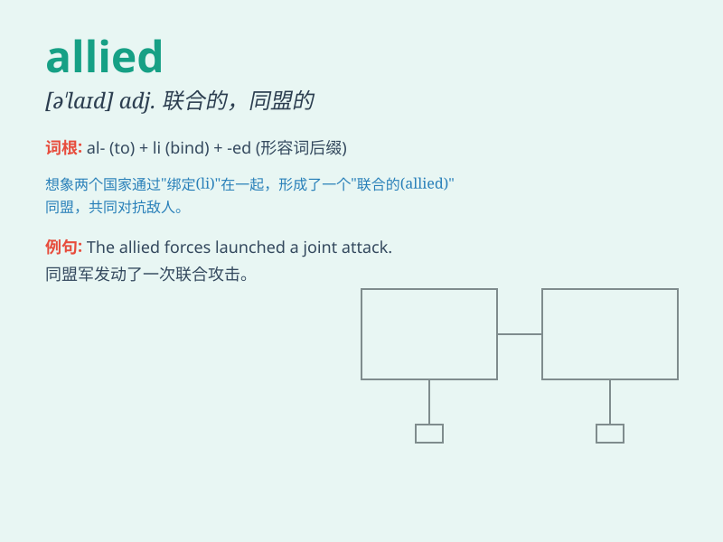

## allied

**英音:** _[\'ælaɪd; ə\'laɪd]_ **美音:**
_[əˈlaɪd,ˈælˌaɪd]_

**译义:** *adj.联合的,同盟的,与\...同属一系v.联合*

### 短语

+ **allied forces:** _盟军；联军_

+ **allied powers:** _同盟国_

+ **allied industries:** _相关产业；关联行业_

+ **allied subjects:** _相关学科；有关科目_

+ **allied health professional:** _医疗辅助专业人员_

### 例句

#### 例句1

> **The Allied forces won the war.**

**中文翻译:** 盟军赢得了这场战争。

**单词释义:** 同盟的；联合的

#### 例句2

> **The company has allied with several partners to expand its
business.**

**中文翻译:** 这家公司与几个合作伙伴结盟以拓展业务。

**单词释义:** 结盟；联合

#### 例句3

> **She is studying allied subjects such as history and
geography.**

**中文翻译:** 她正在学习相关学科，如历史和地理。

**单词释义:** 相关的；有关联的

### 背诵小故事

> In a war, two armies were allied. They fought together against the
common enemy. The allied forces shared resources and strategies, showing
great unity. Remember, \'allied\' means joined or united for a common
purpose.

**在一场战争中，两支军队结盟了。他们一起对抗共同的敌人。盟军共享资源和战略，展现出极大的团结。记住，\'allied\'意思是为了共同目的联合或结盟。**

### 图义

