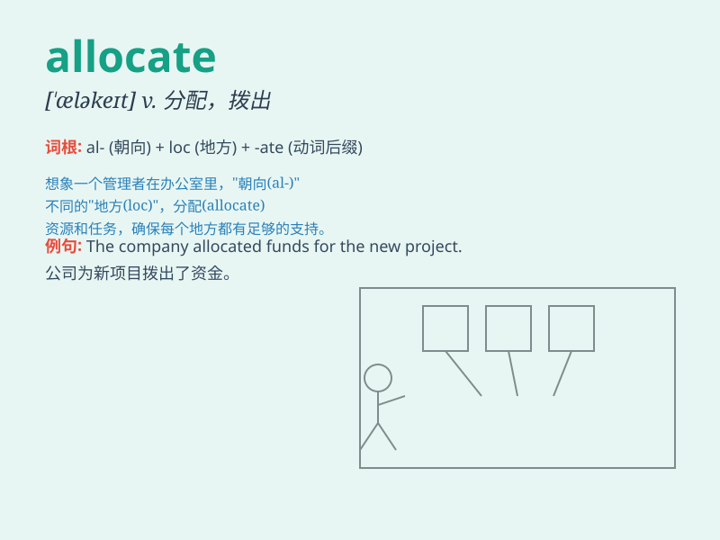

## allocate

**英音:** _[\'æləkeɪt]_ **美音:** _[\'æləket]_

**译义:** *vt.分派,分配*

### 短语

+ **allocate funds:** _分配资金_

+ **allocate resources:** _分配资源_

+ **allocate time:** _分配时间_

+ **allocate tasks:** _分配任务_

+ **allocate space:** _分配空间_

### 例句

#### 例句1

> **The government will allocate funds for education.**

**中文翻译:** 政府将为教育拨款。

**单词释义:** 分配；拨给

#### 例句2

> **We need to allocate more time to this project.**

**中文翻译:** 我们需要给这个项目分配更多的时间。

**单词释义:** 分配；安排

#### 例句3

> **The manager allocated tasks to each team member.**

**中文翻译:** 经理给每个团队成员分配任务。

**单词释义:** 分配；指派

### 背诵小故事

> 想象一个国王要分配他的财宝，他坐在王座上，拿着清单，仔细地思考如何
allocate 这些财宝给不同的大臣和子民，以确保公平和合理。

**想象国王分配财宝的场景来辅助记忆'allocate'这个单词，意思是分配、拨出**

### 图义

