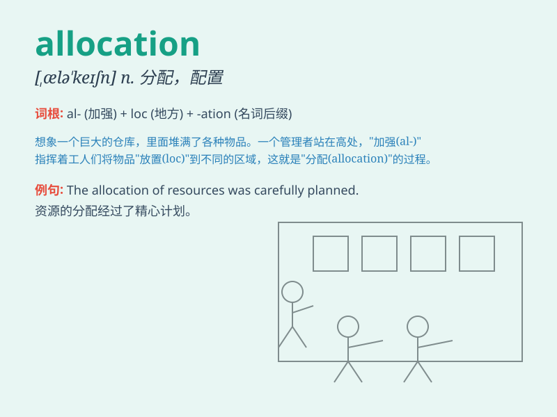

## allocation

**英音:** _[ælə\'keɪʃ(ə)n]_ **美音:** _[,ælə\'keʃən]_

**译义:** *n.分配,安置*

### 短语

+ **resource allocation:** _资源分配_

+ **budget allocation:** _预算分配_

+ **allocation of funds:** _资金分配_

+ **land allocation:** _土地分配_

+ **allocation problem:** _分配问题_

### 例句

#### 例句1

> **The allocation of resources is a crucial decision for any
organization.**

**中文翻译:** 资源的分配对于任何组织来说都是一个关键的决定。

**单词释义:** 分配；配置

#### 例句2

> **The new budget includes an allocation for education.**

**中文翻译:** 新预算包括了教育的拨款。

**单词释义:** 拨款；拨给的款项

#### 例句3

> **The allocation of seats in the auditorium was done randomly.**

**中文翻译:** 礼堂座位的分配是随机进行的。

**单词释义:** 分配；分派

### 背诵小故事

>
想象一个大仓库，里面堆满了各种资源。管理员根据需求进行分配，这个分配的过程就是\'allocation\'。就像把糖果分给小朋友一样，确保公平合理。

**想象一个仓库资源分配的场景来辅助记忆\'allocation\'这个单词，意思是分配，配给**

### 图义

