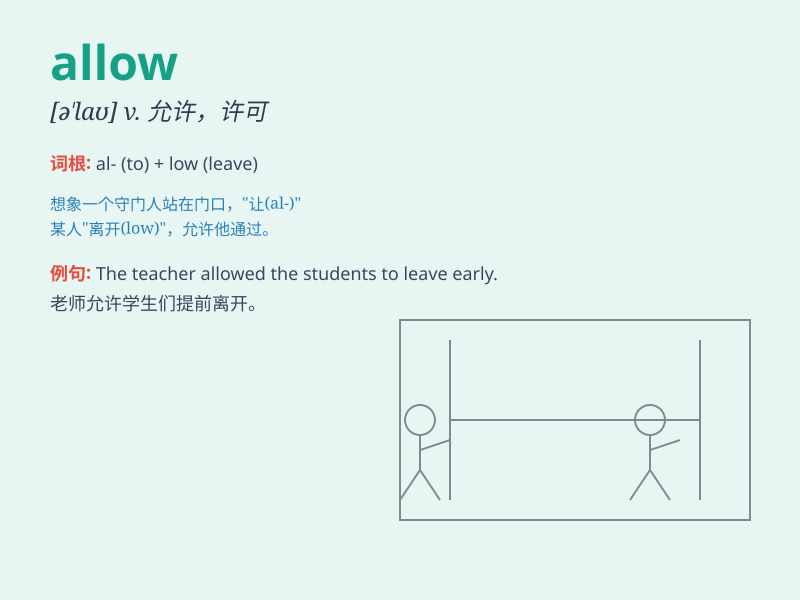

## allow

**英音:** _[ə\'laʊ]_ **美音:** _[ə\'laʊ]_

**译义:** *vt.允许,承认*

### 短语

+ **allow for:** _考虑到；顾及；为...留出余地_

+ **allow of:** _容许；容得_

+ **allow sb. to do sth.:** _允许某人做某事_

+ **be allowed to do sth.:** _被允许做某事_

+ **allow doing sth.:** _允许做某事_

### 例句

#### 例句1

> **My parents don\'t allow me to stay out late.**

**中文翻译:** 我的父母不允许我在外待到很晚。

**单词释义:** 允许

#### 例句2

> **The law doesn\'t allow such actions.**

**中文翻译:** 法律不允许这样的行为。

**单词释义:** 允许

#### 例句3

> **Please allow me a few minutes to explain.**

**中文翻译:** 请给我几分钟时间解释一下。

**单词释义:** 给

### 背诵小故事

> One day, I wanted to go to the park. My mom allowed me to go after I
finished my homework. It made me so happy. I realized \'allow\' means to
give permission.

**有一天，我想去公园。在我完成作业后妈妈允许我去了。这让我非常开心。我明白了'allow'意思是准许、允许。**

### 图义

