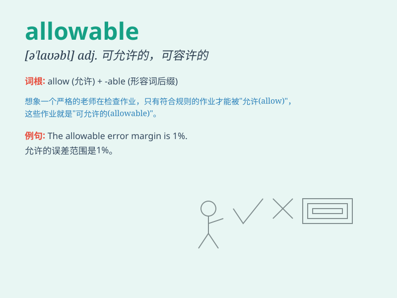

## allowable

**英音:** _[ə\'laʊəbl]_ **美音:** _[ə\'laʊəbl]_

**译义:** *adj.允许的,正当的,可承认的*

### 短语

+ **allowable error:** _容许误差_

+ **allowable limit:** _允许限度；容许极限_

+ **allowable load:** _容许荷载_

+ **allowable range:** _允许范围_

+ **allowable value:** _允许值_

### 例句

#### 例句1

> **The use of mobile phones during the exam is not allowable.**

**中文翻译:** 在考试期间使用手机是不被允许的。

**单词释义:** 被允许的；许可的

#### 例句2

> **There is an allowable margin of error in this measurement.**

**中文翻译:** 在这个测量中有一个允许的误差幅度。

**单词释义:** 允许的；许可的

#### 例句3

> **The allowable weight for this suitcase on the flight is 20
kilograms.**

**中文翻译:** 这个行李箱在航班上允许的重量是 20 公斤。

**单词释义:** 允许的；许可的

### 背诵小故事

> A king set a rule that only a certain amount of food was allowable
for each person at the feast. If you took more, you\'d be punished. So,
\'allowable\' means permitted within certain limits.

**一位国王规定在宴会上每人只能有一定量的食物是被允许的。如果你多拿，就会受到惩罚。所以，\'allowable\'意思是在一定限度内被许可的。**

### 图义

