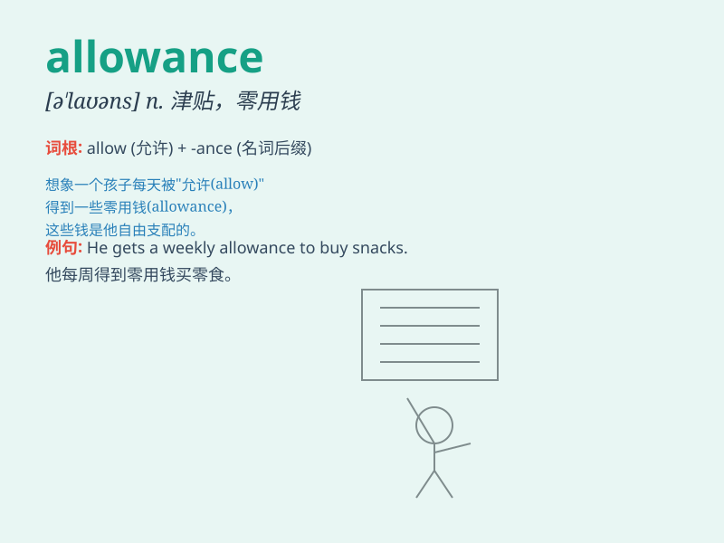

## allowance

**英音:** _[ə\'laʊəns]_ **美音:** _[ə\'laʊəns]_

**译义:** *n.津贴,补助,宽容,允许vt.定量供应*

### 短语

+ **living allowance:** _生活津贴_

+ **housing allowance:** _住房补贴_

+ **travel allowance:** _旅行津贴_

+ **make an allowance:** _给予津贴；留出余地_

+ **allowance for depreciation:** _折旧备抵_

### 例句

#### 例句1

> **My parents give me a weekly allowance of \$20.**

**中文翻译:** 我的父母每周给我 20 美元的零用钱。

**单词释义:** 零用钱；津贴

#### 例句2

> **The company provides a travel allowance for its employees.**

**中文翻译:** 公司为员工提供差旅津贴。

**单词释义:** 津贴；补贴

#### 例句3

> **You should make allowance for his inexperience.**

**中文翻译:** 你应该体谅他的缺乏经验。

**单词释义:** 体谅；考虑到

### 背诵小故事

> A poor student was always worried about money. One day, his school
announced an \'allowance\' program. He was so happy as it meant he could
buy the books he needed. The allowance was like a helping hand in his
studies.

**一个贫困的学生总是为钱发愁。有一天，他的学校宣布了一项'津贴'计划。他非常高兴，因为这意味着他可以买他需要的书。津贴就像是他学习中的援手。**

### 图义

