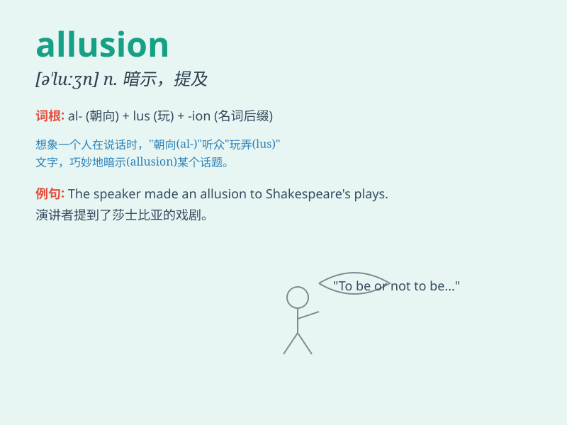

## allusion

**英音:** _[ə\'luːʒ(ə)n; -\'ljuː-]_ **美音:**
_[ə\'lʊʒən]_

**译义:** *n.提及,暗示*

### 短语

+ **make an allusion:** _作出暗示_

+ **without allusion:** _毫无暗示_

+ **veiled allusion:** _含蓄的暗示_

+ **indirect allusion:** _间接的暗示_

+ **frequent allusion:** _频繁的暗示_

### 例句

#### 例句1

> **The poem contains several allusions to classical literature.**

**中文翻译:** 这首诗包含了几处对古典文学的暗示。

**单词释义:** 暗示；提及

#### 例句2

> **His speech was full of allusions to historical events.**

**中文翻译:** 他的演讲充满了对历史事件的影射。

**单词释义:** 影射；暗指

#### 例句3

> **She made an allusion to their past relationship in her novel.**

**中文翻译:** 她在她的小说中提到了他们过去的关系。

**单词释义:** 提及；间接提到

### 背诵小故事

> A little mouse was always making allusion to being a brave lion. One
day, it faced a real challenge and bravely stood up, showing that its
allusion wasn\'t just talk.

**一只小老鼠总是暗示自己是勇敢的狮子。有一天，它面临真正的挑战并勇敢地站了出来，表明它的暗示并非只是说说而已。**

### 图义

