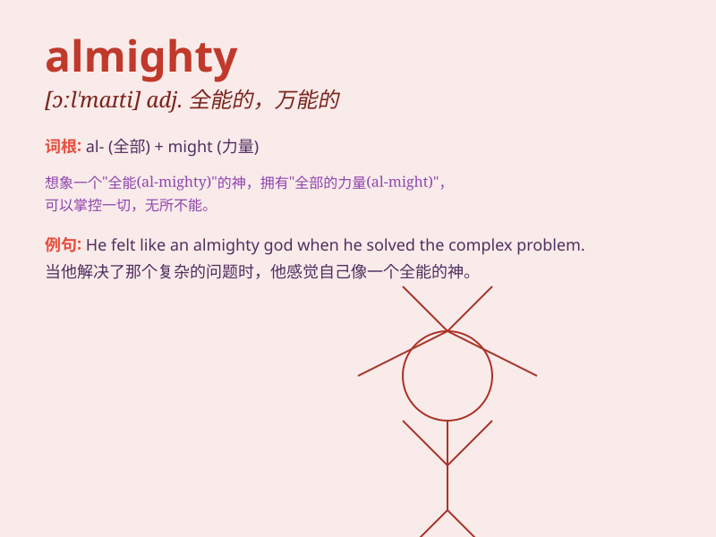

## almighty

**英音:** _[ɔːl\'maɪtɪ]_ **美音:** _[ɔl\'maɪti]_

**译义:** *adj.全能的*

### 短语

+ **almighty God:** _全能的上帝_

+ **the Almighty:** _上帝；全能者_

+ **almighty power:** _万能的力量_

+ **almighty dollar:** _万能的金钱_

+ **almighty force:** _强大的力量_

### 例句

#### 例句1

> **The Almighty has the power to create and destroy.**

**中文翻译:** 全能的上帝拥有创造和毁灭的力量。

**单词释义:** 全能的；有无限权力的

#### 例句2

> **We were faced with an almighty mess after the party.**

**中文翻译:** 聚会后我们面对着一团糟的局面。

**单词释义:** 极大的；十分严重的

#### 例句3

> **Oh Almighty! Please help me through this difficult time.**

**中文翻译:** 哦，全能的神啊！请帮我度过这段艰难的时光。

**单词释义:** 全能的；万能的

### 背诵小故事

>
想象有一位无所不能（almighty）的超级英雄，他能瞬间移动，拯救世界于灾难之中。他的力量无人能敌，任何困难在他面前都能轻松解决，人们对他的全能充满敬畏和感激。

**想象一位全能的超级英雄，展现 almighty
意为全能的、无所不能的意思，人们对其敬畏和感激。**

### 图义

