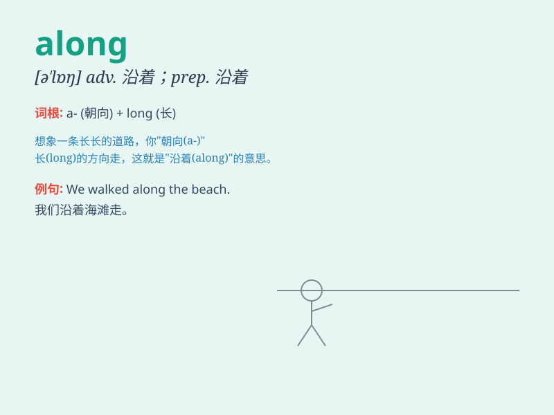

## along

**英音:** _[ə\'lɒŋ]_ **美音:** _[ə\'lɔŋ]_

**译义:** *adv.往前,向前 prep.顺着,沿着*

### 短语

+ **along with:** _连同......一起；与......一道_

+ **get along:** _（与......）和睦相处；进展_

+ **come along:** _出现；一起来；进展_

+ **all along:** _自始至终；一直_

+ **go along:** _进行；前进；赞同_

### 例句

#### 例句1

> **I walked along the river.**

**中文翻译:** 我沿着河走。

**单词释义:** 沿着

#### 例句2

> **Come along with me.**

**中文翻译:** 跟我来。

**单词释义:** 一起；随同

#### 例句3

> **The path runs along the edge of the forest.**

**中文翻译:** 这条小路沿着森林的边缘延伸。

**单词释义:** 沿着

### 背诵小故事

> A little ant was walking along a long road. It was very tired but
kept going along. Finally, it found food along the way. The ant was so
happy!

**一只小蚂蚁正在一条长长的路上走着。它非常累但一直沿着路走。最后，它沿路找到了食物。这只蚂蚁非常开心！**

### 图义

