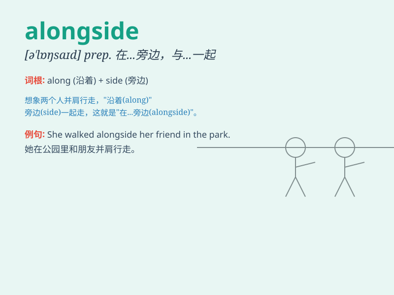

## alongside

**英音:** _[əlɒŋ\'saɪd]_ **美音:** _[ə\'lɔŋ\'saɪd]_

**译义:** *adv.在旁 prep.横靠*

### 短语

+ **alongside of:** _在\...旁边；与\...并肩_

+ **come alongside:** _靠过来_

+ **lie alongside:** _并排躺着_

+ **pull alongside:** _并排停下_

+ **stand alongside:** _站在旁边_

### 例句

#### 例句1

> **The new building stands alongside the old one.**

**中文翻译:** 新大楼矗立在旧大楼旁边。

**单词释义:** 在\...旁边；沿着\...的边

#### 例句2

> **He worked alongside his father in the family business.**

**中文翻译:** 他在家族企业里和他父亲一起工作。

**单词释义:** 与\...一起；并肩

#### 例句3

> **The ship was moored alongside the quay.**

**中文翻译:** 船停泊在码头边。

**单词释义:** 在\...旁边；靠着

### 背诵小故事

>
想象一艘大船在海上航行，旁边（alongside）还有一艘小船紧紧跟随。大船上的人们能清楚看到小船上的情况。Alongside
就是指在旁边、并排的意思。

**想象一艘大船在海上航行，旁边还有一艘小船紧紧跟随。大船上的人们能清楚看到小船上的情况。Alongside
就是指在旁边、并排的意思。**

### 图义

