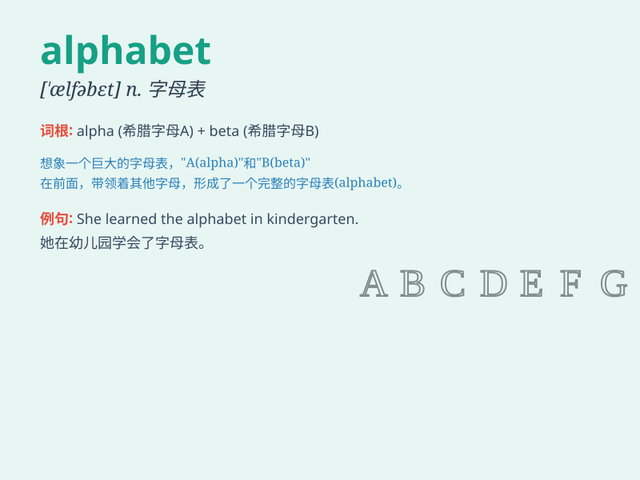

## alphabet

**英音:** _[\'ælfəbet]_ **美音:** _[\'ælfə\'bɛt]_

**译义:** *n.字母表*

### 短语

+ **phonetic alphabet:** _音标；语音字母表_

+ **military alphabet:** _军事字母表_

+ **alphabet soup:** _字母形花片汤_

+ **the Cyrillic alphabet:** _西里尔字母表_

+ **the Greek alphabet:** _希腊字母表_

### 例句

#### 例句1

> **The English alphabet has 26 letters.**

**中文翻译:** 英语字母表有 26 个字母。

**单词释义:** 字母表

#### 例句2

> **Children learn the alphabet at school.**

**中文翻译:** 孩子们在学校学习字母表。

**单词释义:** 字母表

#### 例句3

> **She recited the alphabet from A to Z.**

**中文翻译:** 她从头到尾背诵了字母表。

**单词释义:** 字母表

### 背诵小故事

>
从前有一只聪明的小猴子，它要给森林里的动物们写信。但它发现没有合适的符号来表达意思，于是创造了
26 个不同的符号，这 26 个符号组合起来就像神奇的密码，被称为
alphabet，也就是字母表。

**从前有一只聪明的小猴子创造了 26 个符号，组合起来被称为字母表**

### 图义

