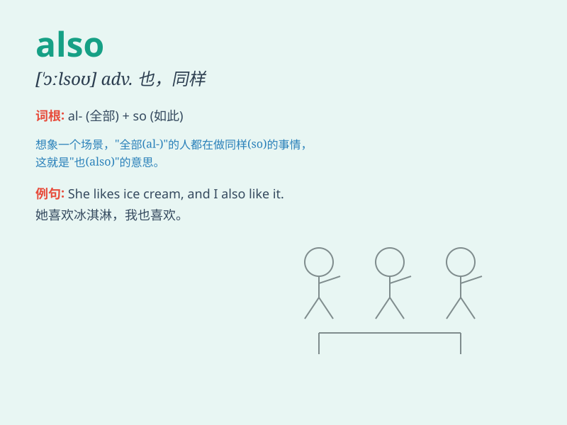

## also

**英音:** _[\'ɔːlsəʊ]_ **美音:** _[\'ɔlso]_

**译义:** *adv.也,同样*

### 短语

+ **also known as:** _也被称为_

+ **also ran:** _落选者；失败者_

+ **not only\... but also\...:** _不但......而且......_

+ **also-ran candidate:** _落选的候选人_

+ **also have:** _也有_

### 例句

#### 例句1

> **I like apples. Also, I enjoy oranges.**

**中文翻译:** 我喜欢苹果。并且，我也喜欢橙子。

**单词释义:** 而且；此外

#### 例句2

> **He is good at math. Also, he is excellent in physics.**

**中文翻译:** 他擅长数学。同样，他的物理也很出色。

**单词释义:** 也；同样

#### 例句3

> **She sings beautifully. Also, she dances gracefully.**

**中文翻译:** 她唱歌动听。而且，她跳舞也优美。

**单词释义:** 并且

### 背诵小故事

> One day, Tom went to a party. He ate delicious food and met many
friends. His friend Jerry was there too. \'Also\' Jerry had a great
time. It means in addition or as well.

**一天，汤姆去参加派对。他吃了美味的食物，还见到了很多朋友。他的朋友杰瑞也在。"Also"杰瑞也玩得很开心。它的意思是此外，也。**

### 图义

