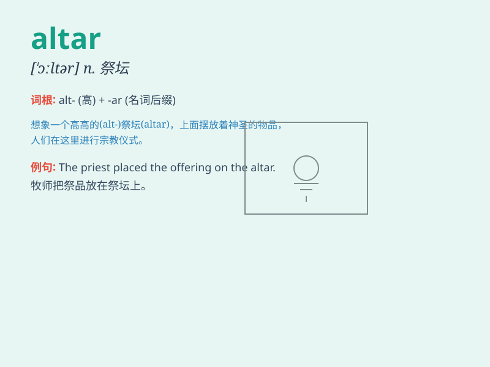

## altar

**英音:** _[\'ɔːltə; \'ɒl-]_ **美音:** _[\'ɔltɚ]_

**译义:** *n.祭坛,(基督教教堂内的)圣坛,祈祷祭拜的地方*

### 短语

+ **altar boy:** _祭台助手（在天主教弥撒中协助神父的男童）_

+ **altar rail:** _圣坛栏杆_

+ **altar piece:** _（教堂内的）圣坛装饰画_

+ **altar call:** _（宗教集会时邀请人们到圣坛前表示信仰的）呼召_

+ **altar cloth:** _圣坛布_

### 例句

#### 例句1

> **The priest stood at the altar and began the ceremony.**

**中文翻译:** 牧师站在祭坛前并开始了仪式。

**单词释义:** 祭坛

#### 例句2

> **They placed the flowers on the altar as a tribute.**

**中文翻译:** 他们把花放在祭坛上作为献礼。

**单词释义:** 祭坛

#### 例句3

> **The old church\'s altar was beautifully decorated.**

**中文翻译:** 这座古老教堂的祭坛装饰得很美。

**单词释义:** 祭坛

### 背诵小故事

> A long time ago, a young man was lost in a forest. When he was about
to give up, he saw a mysterious light and followed it. It led him to an
altar where he found hope and guidance. The altar became a symbol of
salvation for him.

**很久以前，一个年轻人在森林里迷路了。当他快要放弃时，看到了一道神秘的光并跟着它。光把他引到了一个圣坛前，在那里他找到了希望和指引。这个圣坛成了他的救赎象征。**

### 图义

