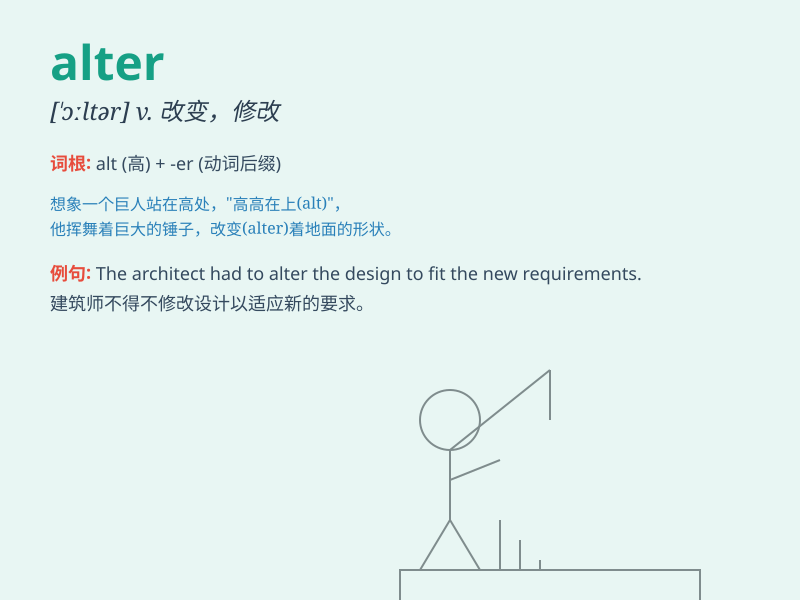

## alter

**英音:** _[\'ɔːltə; \'ɒl-]_ **美音:** _[\'ɔltɚ]_

**译义:** *v.改变*

### 短语

+ **alter ego:** _另一个自我；个性的另一面；密友_

+ **alter course:** _改变路线；改变航向_

+ **alter one\'s mind:** _改变主意_

+ **alter circumstances:** _改变情况；改变环境_

+ **alter appearance:** _改变外貌；改变外观_

### 例句

#### 例句1

> **She had to alter her dress for the party.**

**中文翻译:** 她不得不为聚会改一下她的裙子。

**单词释义:** 修改；改变

#### 例句2

> **The weather can alter our plans for the picnic.**

**中文翻译:** 天气可能会改变我们野餐的计划。

**单词释义:** 改变；更改

#### 例句3

> **The new law will alter the way we do business.**

**中文翻译:** 新法律将改变我们做生意的方式。

**单词释义:** 变更；改动

### 背诵小故事

> A tailor found that the clothes needed to be altered. He had to
change the size and style to make them fit better. So, \'alter\' means
to change or modify something.

**一位裁缝发现衣服需要修改。他不得不改变尺寸和样式以使它们更合身。所以，'alter'意思是改变或修改某物。**

### 图义

